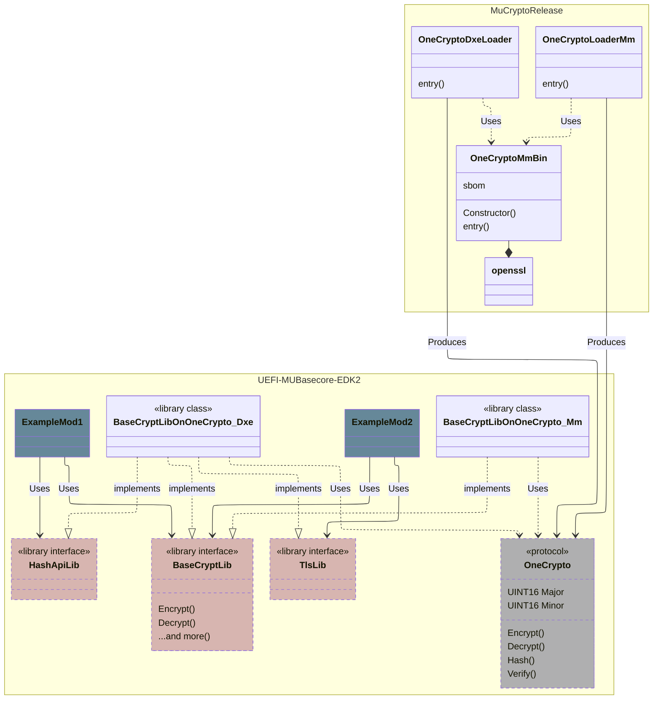
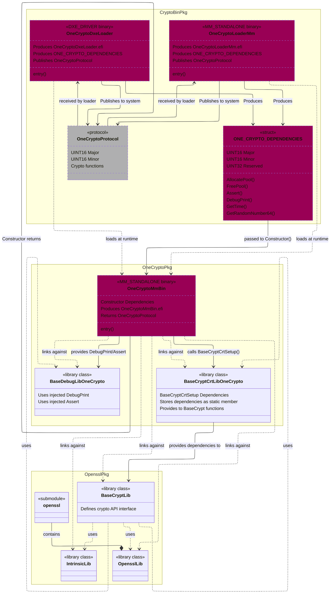
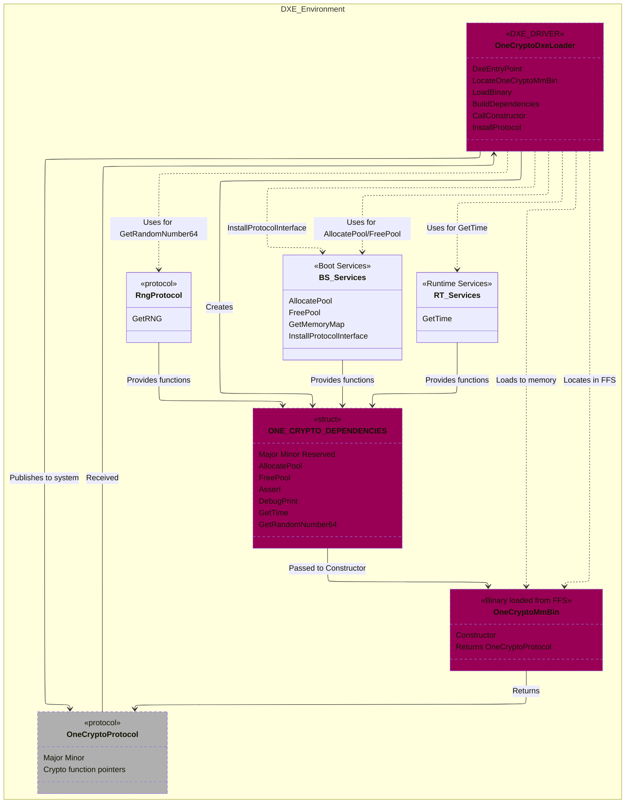
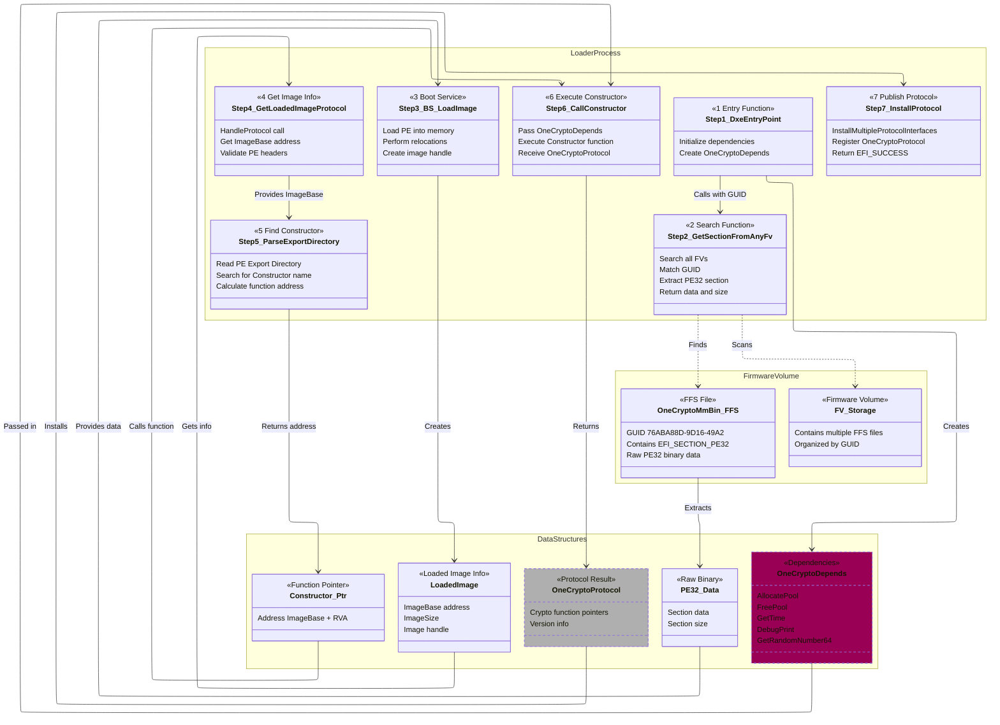
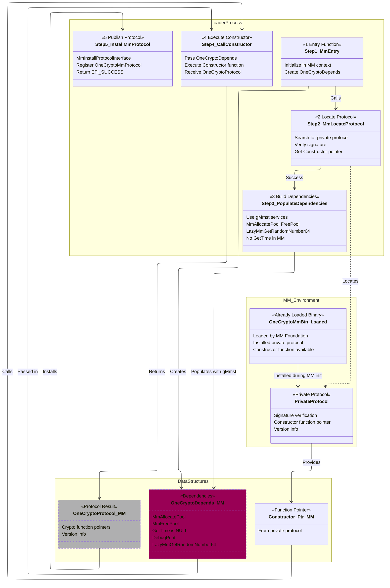

# OneCrypto Architecture

> **⚠️ Platform Support Notice:**  
> This architecture is currently **X64 ONLY**. AArch64 platforms require a different model due to architectural differences in StandaloneMm and firmware volume handling. See [Platform and Architecture Considerations](#platform-and-architecture-considerations) for details.

## Overview

OneCrypto is a refactoring of the MuCryptoRelease, MuSharedCrypto, and CryptoBinary concepts. This effort is focused on simplifying and improving industry adoption, reliability, and compatibility. The goal is to help all parties shipping products with cryptographic support do it better and stay up to date more easily.

### Repositories

- **`MuCryptoRelease`** - Repository and project for building the crypto binary and carrying crypto library dependencies like OpenSSL
- **`UEFI-MuBaseCore-Edk2`** - Generic representation of the "fork" of common code that is common in UEFI industry, providing the interface for crypto and other common services

### Key Benefits

1. **Simplified Updates**: Make it much easier to update crypto for many platforms and stay current with minimal validation
2. **Reduced Build Cost**: No need to download and compile OpenSSL for every platform build
3. **Flash Size Savings**: One copy of crypto instead of 2-3 per phase (DXE, SMM, MM)
4. **Better Tracking**: Unified crypto inventory for SBOM and vulnerability management
5. **Crypto Agility**: Easy to track and update crypto usage across ecosystem
6. **Supply Chain Benefits**: Reduced SDL tool triggers from OpenSSL test dependencies
7. **Future Ready**: Support for Post Quantum Computing (PQC) and other algorithm changes

## Code Layout

The OneCrypto architecture is implemented across multiple packages, each with specific responsibilities.

### MU_BASECORE

The MU_BASECORE repository contains the core UEFI/EDK2 code with OneCrypto integration points. Changes here define the public interfaces that platforms and modules use.

**Key Components:**

- **`CryptoPkg/Include/Library/BaseCryptLib.h`**
  - Defines the standard cryptographic API interface used by all UEFI modules
  - This is the stable API that modules depend on
  - No knowledge of OneCrypto implementation details

- **`CryptoPkg/Include/Protocol/OneCrypto.h`**
  - Defines the `ONE_CRYPTO_PROTOCOL` structure with versioned crypto function pointers
  - Contains protocol GUIDs: `gOneCryptoDxeProtocolGuid`, `gOneCryptoMmProtocolGuid`, `gOneCryptoPrivateProtocolGuid`
  - Version fields: `UINT16 Major`, `UINT16 Minor`
  - All crypto function signatures and documentation

- **`CryptoPkg/Library/BaseCryptLibOnOneCrypto/`**
  - Implementation of BaseCryptLib that locates and calls OneCrypto protocol
  - Phase-specific instances:
    - `BaseCryptLibOnOneCrypto_Dxe` - Locates DXE protocol via Boot Services
    - `BaseCryptLibOnOneCrypto_Mm` - Locates MM protocol via MM Services
  - Checks protocol version before calling functions to ensure compatibility
  - Thin wrapper layer with minimal logic

- **`CryptoPkg/Library/BaseCryptLibNull/`**
  - Null implementation that returns errors for all functions
  - Used when crypto is not available or during early boot phases

### OpensslPkg

The OpensslPkg provides the OpenSSL cryptographic library and a traditional BaseCryptLib implementation. In the OneCrypto architecture, this package is used to build the `OneCryptoMmBin.efi` binary but is not required by platforms at build time.

**Key Components:**

- **`Library/OpensslLib/`**
  - Wrapper around the OpenSSL submodule
  - Provides the actual cryptographic implementations
  - Large library with all OpenSSL functionality

- **`Library/BaseCryptLib/`**
  - Traditional implementation of BaseCryptLib using OpenSSL directly
  - Used by OneCryptoMmBin to implement crypto functions
  - Statically linked into OneCryptoMmBin.efi

- **`Library/IntrinsicLib/`**
  - Compiler intrinsic functions required by OpenSSL
  - Platform-specific assembly and C implementations

**Alternatives:**

> [!NOTE]
> OpensslPkg can be compiled against standard EDK2 or other forks. Additionally, alternative cryptographic packages could be created (e.g., `SymCryptPkg`, `MbedTlsPkg`) following the same pattern to provide different crypto backend implementations.

### OneCryptoPkg

OneCryptoPkg builds the standalone crypto binary (`OneCryptoMmBin.efi`) that contains all cryptographic functionality. This binary is phase-independent and loaded by the loaders.

**Key Components:**

- **`OneCryptoMmBin/`**
  - Main binary application that provides crypto services
  - Links against OpensslPkg's BaseCryptLib and OpensslLib
  - Exports a `Constructor` function in PE export table
  - Constructor signature: `EFI_STATUS Constructor(ONE_CRYPTO_DEPENDENCIES *Depends, VOID **ProtocolOut, UINTN *ProtocolSizeOut)`

- **`Include/Private/OneCryptoDependencySupport.h`**
  - Defines `ONE_CRYPTO_DEPENDENCIES` structure (Major, Minor, Reserved, function pointers)
  - Defines `ONE_CRYPTO_BINARY_GUID` (76ABA88D-9D16-49A2-AA3A-DB6112FAC5CC)
  - Defines dependency function signatures (AllocatePool, FreePool, GetTime, etc.)

- **`Include/Protocol/OneCryptoProtocol.h`**
  - Local copy of protocol definition (should match MU_BASECORE version)
  - Used during OneCryptoMmBin build

- **`Library/BaseCryptCrtLibOneCrypto/`**
  - CRT (C Runtime) library implementation using injected dependencies
  - Stores `ONE_CRYPTO_DEPENDENCIES` pointer as static member
  - Provides malloc, free, memcpy, etc. using dependency functions
  - Called by OpenSSL code that needs C runtime services

- **`Library/BaseDebugLibOneCrypto/`**
  - Debug library implementation using injected DebugPrint
  - Provides DEBUG() and ASSERT() macros
  - Routes to dependency-provided functions

**Build Output:**
- `OneCryptoMmBin.efi` - Standalone MM binary (~1.4 MB)
- Contains complete crypto implementation
- Phase-independent, relocatable PE32 binary

### CryptoBinPkg

CryptoBinPkg builds the small loader drivers that find, load, and initialize `OneCryptoMmBin.efi` in each phase. These loaders have no build-time dependency on OpenSSL or OneCryptoPkg.

**Key Components:**

- **`Driver/OneCryptoLoaderDxe.c` / `OneCryptoLoaderDxe.inf`**
  - DXE phase loader driver (~15 KB)
  - Entry: `DxeEntryPoint()`
  - Uses `GetSectionFromAnyFv()` to search firmware volumes for OneCryptoMmBin GUID
  - Uses `gBS->LoadImage()` to load PE32 into memory with relocations
  - Parses PE export directory to find `Constructor` function
  - Populates `ONE_CRYPTO_DEPENDENCIES` with Boot Services and Runtime Services
  - Calls Constructor to get `ONE_CRYPTO_PROTOCOL`
  - Installs protocol with `gBS->InstallMultipleProtocolInterfaces()`

- **`Driver/OneCryptoLoaderMm.c` / `OneCryptoLoaderMm.inf`**
  - MM phase loader driver (~4 KB)
  - Entry: `MmEntry()`
  - OneCryptoMmBin already loaded by MM Foundation
  - Uses `gMmst->MmLocateProtocol()` to find private protocol
  - Private protocol provides Constructor function pointer directly
  - Populates `ONE_CRYPTO_DEPENDENCIES` with MM Services (GetTime=NULL)
  - Calls Constructor to get `ONE_CRYPTO_PROTOCOL`
  - Installs protocol with `gMmst->MmInstallProtocolInterface()`

- **`Driver/OneCryptoLoaderDriverSupport.h`**
  - Common structures and definitions shared by loaders
  - `DRIVER_DEPENDENCIES` structure for loader-specific state

- **`Driver/PeCoffLib.c` / `PeCoffLib.h`**
  - PE/COFF parsing utilities for DXE loader
  - Export directory parsing to find Constructor function
  - Image validation and symbol resolution

- **`Support/OneCryptoDxeLoader.inf`** and **`Support/OneCryptoLoaderMm.inf`**
  - Library-style INF files for platform integration
  - Allow platforms to include loaders as dependencies

**Build Outputs:**
- `OneCryptoDxeLoader.efi` - DXE loader (~15 KB)
- `OneCryptoLoaderMm.efi` - MM loader (~4 KB)

### Package Dependencies

**Build-time dependencies:**
```
MU_BASECORE (defines interfaces)
    ↑
    ├── OpensslPkg (uses BaseCryptLib interface)
    ↑       ↑
    |       └── OneCryptoPkg (builds against OpensslPkg)
    |
    └── CryptoBinPkg (uses protocol definitions only)
```

**Runtime dependencies:**
```
Platform Module
    ↓ (uses)
BaseCryptLib interface
    ↓ (implemented by)
BaseCryptLibOnOneCrypto
    ↓ (locates and calls)
ONE_CRYPTO_PROTOCOL
    ↑ (installed by)
OneCryptoDxeLoader or OneCryptoLoaderMm
    ↓ (loads and initializes)
OneCryptoMmBin.efi (contains OpenSSL)
```

### Key Design Points

1. **No Build-time Coupling**: CryptoBinPkg loaders have no build dependency on OpenSSL or OneCryptoPkg
2. **Phase-Agnostic Binary**: OneCryptoMmBin.efi only uses Base* libraries (BaseLib, BaseMemoryLib, etc.)
3. **Dependency Injection**: All phase-specific services passed via `ONE_CRYPTO_DEPENDENCIES` structure
4. **Version Checking**: Protocol consumers check Major.Minor version before calling new functions
5. **Single Binary**: One copy of crypto in flash instead of 2-3 per phase
6. **Loader Flexibility**: Different loaders for DXE, MM, SMM, SupvMm without changing OneCryptoMmBin

## Architecture & Design

### Consumer Design

This diagram shows how platform modules consume cryptographic services through the OneCrypto architecture.



**Key Points:**
- Platform modules use the standard `BaseCryptLib` interface
- Phase-specific `BaseCryptLibOnOneCrypto` implementations locate and call the `OneCrypto` protocol
- Loaders install the protocol after loading `OneCryptoMmBin.efi`
- No direct dependency on OpenSSL for platform modules

### Internal Design - Package Dependencies

The following diagram shows the build-time package dependencies and the relationship between the three main packages in MuCryptoRelease.



#### Package Relationship Summary

1. **OpensslPkg**: Contains OpenSSL library and BaseCryptLib implementation
   - Provides the core cryptographic functionality
   - BaseCryptLib defines the crypto API interface
   - BaseCryptLib implementation uses OpensslLib

2. **OneCryptoPkg**: Builds the standalone crypto binary
   - **Depends on**: OpensslPkg (BaseCryptLib, OpensslLib, IntrinsicLib)
   - **Depends on**: Phase-agnostic Base* libraries only (BaseLib, BaseMemoryLib, etc.)
   - **Produces**: `OneCryptoMmBin.efi` - standalone MM binary with all crypto functionality
   - Contains the OneCrypto protocol implementation
   - Uses dependency injection for phase-specific services (via OneCryptoDependencySupport)

3. **CryptoBinPkg**: Builds the loader drivers
   - **No build-time dependency** on OpensslPkg or OneCryptoPkg
   - **Depends on**: Phase-agnostic Base* libraries only
   - **Runtime dependency**: Loaders find and load `OneCryptoMmBin.efi` from FFS
   - **Produces**: 
     - `OneCryptoDxeLoader.efi` - DXE phase loader
     - `OneCryptoLoaderMm.efi` - MM phase loader
   - Creates `ONE_CRYPTO_DEPENDENCIES` structure and passes to Constructor
   - Receives `OneCryptoProtocol` from Constructor and publishes it

> [!IMPORTANT]
> **Library Dependency Constraint**: OneCryptoPkg and all its dependencies must only use phase-agnostic Base* libraries (BaseLib, BaseMemoryLib, BasePrintLib, etc.) to ensure the binary can be loaded and executed in any phase (DXE, MM, SMM, etc.). Phase-specific services are provided through the dependency injection mechanism defined in OneCryptoDependencySupport.h.

### Dependency Injection Pattern

OneCrypto uses dependency injection to make the crypto binary phase-independent. The loader passes a `ONE_CRYPTO_DEPENDENCIES` structure to the Constructor function:

```c
typedef struct _ONE_CRYPTO_DEPENDENCIES {
  UINT16                  Major;                // Version Major
  UINT16                  Minor;                // Version Minor
  UINT32                  Reserved;             // Padding for alignment
  ALLOCATE_POOL           AllocatePool;         // Memory allocation
  FREE_POOL               FreePool;             // Memory deallocation
  ASSERT_T                ASSERT;               // Assertion checking
  GET_TIME                GetTime;              // System time retrieval (NULL in MM)
  DEBUG_PRINT             DebugPrint;           // Debug message output
  GET_RANDOM_NUMBER_64    GetRandomNumber64;    // Random number generation
} ONE_CRYPTO_DEPENDENCIES;
```

**How it works:**
1. Loader creates and populates the structure with phase-specific function pointers
2. Loader calls `Constructor(Depends, &ProtocolOut, &SizeOut)`
3. OneCryptoMmBin stores the dependency pointer internally
4. BaseCryptCrtLibOneCrypto and BaseDebugLibOneCrypto use these functions
5. OpenSSL code indirectly calls the phase-specific services

### Versioning Strategy

The OneCrypto protocol uses a two-field versioning scheme to ensure compatibility:

| Version Field | Format | Description |
| ------------- | ------ | ----------- |
| `Major`       | xx.00  | Protocol structure breaking change. Caller must be aware of the structure of the major version. If removal of a function or other structure altering (other than appending) is desired, the `Major` version must be incremented. |
| `Minor`       | 00.xx  | Functions appended to the end. No change in earlier functions and offsets - binary compatible. This is the ideal change providing greatest flexibility/compatibility between callers and implementation. |

**Version Checking:**
- BaseCryptLibOnOneCrypto checks protocol version before calling functions
- New functions only called if `(Major == expected && Minor >= required)`
- Allows new crypto functions to be added without breaking old callers
- Enables gradual platform updates

## Runtime Behavior

### DXE Environment

#### High-Level Loader Flow

This diagram shows the detailed flow of how the OneCryptoDxeLoader works in the DXE phase environment.



**DXE Loader Steps:**

1. **Entry Point**: OneCryptoDxeLoader starts at DxeEntryPoint
2. **Locate Binary**: Searches FFS for OneCryptoMmBin using its GUID
3. **Load Binary**: Loads OneCryptoMmBin into memory and relocates it
4. **Build Dependencies**: Creates ONE_CRYPTO_DEPENDENCIES structure:
   - Maps Boot Services functions (AllocatePool, FreePool)
   - Maps Runtime Services functions (GetTime)
   - Locates RNG protocol and maps GetRandomNumber64
   - Provides DebugPrint and Assert wrappers
5. **Call Constructor**: Calls OneCryptoMmBin's Constructor with dependencies
6. **Receive Protocol**: Constructor returns OneCryptoProtocol structure
7. **Install Protocol**: Uses Boot Services to install protocol, making it available system-wide

#### Detailed Loading Mechanism (DXE)

This diagram shows the detailed process of how the DXE loader locates and loads the OneCryptoMmBin binary from firmware volumes.



**Detailed Steps:**

**Step 1: Locate Binary in FFS**
- Uses `GetSectionFromAnyFv()` to search all firmware volumes
- Searches for GUID `76ABA88D-9D16-49A2-AA3A-DB6112FAC5CC` (OneCryptoMmBin)
- Looks for `EFI_SECTION_PE32` section type
- Extracts raw PE32 binary data and size

**Step 2: Load PE Image**
- Calls Boot Services `LoadImage()` with extracted PE32 data
- UEFI loads the image into memory
- Performs PE relocations based on load address
- Creates a loaded image handle

**Step 3: Get Image Information**
- Retrieves `EFI_LOADED_IMAGE_PROTOCOL` from the handle
- Validates:
  - ImageBase is valid
  - Image has correct PE headers
  - ImageType is `EFI_IMAGE_SUBSYSTEM_EFI_BOOT_SERVICE_DRIVER`

**Step 4: Find Constructor Function**
- Parses PE export directory from loaded image
- Searches exports for function named "Constructor"
- Calculates function address: `ImageBase + RVA`
- Returns function pointer for calling

**Step 5: Call Constructor and Install**
- Populates `ONE_CRYPTO_DEPENDENCIES` structure with DXE-specific services
- Calls Constructor function with dependencies
- Receives `OneCryptoProtocol` structure
- Installs protocol using `InstallMultipleProtocolInterfaces()`

### StandaloneMm Environment

#### MM Loader Flow

This diagram shows how the MM loader accesses the OneCryptoMmBin binary that is already loaded in the MM environment.



**MM Loader Key Differences:**

1. **No FFS Search**: OneCryptoMmBin is already loaded by MM Foundation before the loader runs
2. **Private Protocol**: OneCryptoMmBin installs a private protocol during its initialization that provides the Constructor
3. **Simpler Flow**: No need to load PE, parse exports, or relocate - just locate the protocol
4. **MM-Specific Services**: Uses `gMmst` (MM System Table) instead of Boot Services
5. **No GetTime**: MM environment doesn't have GetTime, so it's set to NULL in dependencies
6. **RNG Required**: MM environment should provide EFI_RNG_PROTOCOL - loader asserts if unavailable

### Loader Module Responsibilities

Each loader module (`OneCryptoDxeLoader`, `OneCryptoLoaderMm`, future `OneCryptoLoaderSmm`, `OneCryptoLoaderSupvMm`) must:

1. Locate the `OneCryptoMmBin` module FFS (or access already-loaded binary)
2. Load it so that it is executable in the current phase/environment
3. Collect the dependencies required by the module
4. Call the `OneCryptoMmBin::Constructor` - takes dependency struct, returns protocol structure
5. Publish the protocol structure in the phase-specific method
6. Now cryptographic services are available for usage by other modules

## Supported Environments

OneCrypto supports multiple UEFI execution environments, each with unique characteristics:

| Identifier | Description | Architecture | Notes |
|------------|-------------|--------------|-------|
| `Dxe` | UEFI DXE Phase | ARM64, X64 | Architecture differences affect some OneCrypto implementation details. Full Boot Services and Runtime Services available. |
| `Mm` | Standalone MM (UEFI PI spec) | ARM64, X64 | ARM64 and X64 implementations differ significantly. On ARM64, StMM is inside a secure partition loaded before UEFI in BL phases. The StMM "firmware" may not be available to UEFI code, affecting binary sharing. |
| `Smm` | Traditional SMM (UEFI PI spec) | X64 only | Legacy system management mode with restricted services. |
| `SupvMm` | Supervised Standalone MM (Project Mu MM Supervisor) | X64 only | Must support running in CPL3 and may need syscalls for certain operations. |

### Environment-Specific Considerations

**DXE Phase:**
- Full Boot Services and Runtime Services available
- RNG protocol available but gracefully degrades if missing
- GetTime available via Runtime Services
- Loader must search FFS and load PE32 binary

**StandaloneMm (ARM64):**
- StMM loaded in secure partition before UEFI
- May have different memory isolation
- Binary sharing between UEFI and StMM requires special handling
- Limited services compared to DXE

**StandaloneMm (X64) / Traditional SMM:**
- Loaded and initialized by CPU driver
- MM System Table (`gMmst`) provides services
- No GetTime available (set to NULL)
- RNG protocol required (loader asserts if unavailable)
- OneCryptoMmBin already loaded by MM Foundation

**Supervised MM (SupvMm):**
- Runs in CPL3 (user mode)
- Requires syscalls for privileged operations
- Enhanced security isolation
- Project Mu MM Supervisor specific

## Operations & Workflows

### Adding a New Crypto Function

A user requests a new crypto function be added to the crypto stack in UEFI.

#### Step 1 - Mu Basecore Update

1. Update `CryptoPkg/Include/Library/BaseCryptLib.h` header file to add new function
2. Update the `CryptoPkg/Library/BaseCryptLibNull.c` to resolve the new function.
3. Update the OneCryptoProtocol definition in `CryptoPkg/Include/Protocol/OneCrypto.h` increasing the minor version number
4. Update the BaseCryptLibOnOneCrypto implementation in `CryptoPkg/Library/BaseCryptLibOnOneCrypto` to only call function if binary is new version number or greater.  
5. Merge into the release branch making clear that support is not complete.

> [!IMPORTANT]
> You still don't have a system with the new support. Your caller can compile but OneCrypto hasn't yet added support.

#### Step 2 - OneCrypto Update

1. Update the submodule for Mu Basecore to the version with change.
2. Update the OneCryptoMmBin implementation to set the new function pointers in the protocol to appropriate functions
3. Update the sbom and version data needed
4. Make a draft release  

#### Step 3 - Platform Testing / Upgrade ahead of Mu Basecore

1. Update the platform Mu Basecore version to a version with the necessary changes in BaseCryptLib
2. Override the extdep for OneCryptoMmBin and loaders to the draft version created above
3. Update the platform, build, and test

#### Step 4 - Official release

1. Promote draft release
2. In Mu Basecore update the extdep

#### Step 5 - Update your Platform (common path)

1. Update the platform Mu Basecore version to a version with the necessary changes in BaseCryptLib
2. Assuming your platform is using the Mu Basecore defined extdep for OneCryptoMmBin, a Stuart Update is all that should be needed for an update. If not, then update your extdep yourself to the newer version.

### Upgrading OpenSSL / Updating Crypto Due to Vulnerability

#### Step 1 - OneCrypto Update

1. Update the openssl with the patch or new version
2. Update your OneCrypto version information (no protocol version change)
3. Update the OneCrypto sbom data based on OpenSSL dependencies.
4. Do testing and validation as needed.
5. Release and publish the new binary.

#### Step 2 - Mu Basecore Update

1. Update the extdep in MuBasecore to pull the dependency
2. Backport to any branches as necessary.

#### Step 3 - Update your Platform

1. Update the Mu Basecore dependency.  

OR if that requires other changes you could do 1 of 2 things:

1. Request Mu basecore create a targeted branch given your base commit plus this one extdep change.  
OR
2. Override the extdep using extdep override syntax with your own extdep that has the new version. Probably need some way to track this and ensure you remove it later when you do a full update.

### Adding New Dependencies Between Loader and OneCryptoMmBin

(To be documented)

## Platform Integration

### Required Components

Platforms must include three components:

1. **OneCryptoBin** - The phase-independent binary (REQUIRED)
2. **OneCryptoDxeLoader** - DXE loader driver
3. **OneCryptoLoaderMm** - MM loader driver

### Firmware Volume Placement

**Critical Rule:** The OneCryptoBin binary must be in the **same firmware volume** as the environment that will use it.

```
┌─────────────────────────────────────────────────────────────────────┐
│                   Firmware Volume Layout                            │
└─────────────────────────────────────────────────────────────────────┘

 FLASH IMAGE
 ───────────

  ┌────────────────────────────────────────────────────────────┐
  │                        FV.DXEFV                            │
  │  ┌──────────────────────────────────────────────────────┐  │
  │  │  DXE Core                                            │  │
  │  ├──────────────────────────────────────────────────────┤  │
  │  │  OneCryptoDxeLoader.efi         ◄─── Loader Driver   │  │
  │  ├──────────────────────────────────────────────────────┤  │
  │  │  OneCryptoBin.efi (optional)    ◄─── Binary          │  │
  │  ├──────────────────────────────────────────────────────┤  │
  │  │  Other DXE Drivers                                   │  │
  │  │  • NetworkPkg drivers (use crypto)                   │  │
  │  │  • SecureBoot drivers (use crypto)                   │  │
  │  └──────────────────────────────────────────────────────┘  │
  └────────────────────────────────────────────────────────────┘
                             │
                             │ OneCryptoDxeLoader searches
                             │ for binary in accessible FVs
                             ▼
  ┌────────────────────────────────────────────────────────────┐
  │                       FV.MMFV (SMM)                        │
  │  ┌──────────────────────────────────────────────────────┐  │
  │  │  MM Core / StandaloneMm Core                         │  │
  │  ├──────────────────────────────────────────────────────┤  │
  │  │  OneCryptoBin.efi               ◄─── Binary (MUST!)  │  │◄─┐
  │  ├──────────────────────────────────────────────────────┤  │  │
  │  │  OneCryptoLoaderMm.efi          ◄─── Loader Driver   │  │  │
  │  ├──────────────────────────────────────────────────────┤  │  │
  │  │  Other MM Drivers                                    │  │  │
  │  │  • Variable services (use crypto)                    │  │  │
  │  │  • TPM drivers (use crypto)                          │  │  │
  │  │  • FTW drivers (use crypto)                          │  │  │
  │  └──────────────────────────────────────────────────────┘  │  │
  └────────────────────────────────────────────────────────────┘  │
                                                                  │
      CRITICAL: Binary MUST be in same FV as MM environment ──────┘
                (StandaloneMm core loads all drivers from its FV
                 during initialization, including OneCryptoBin)

Memory Layout After Loading:
─────────────────────────────

  DXE Memory Space                    MMRAM Space
  ────────────────                    ───────────

  ┌──────────────────┐                ┌──────────────────┐
  │ OneCryptoBin     │                │ OneCryptoBin     │
  │ (Loaded by       │                │ (Loaded by       │
  │  DxeLoader)      │                │  MM Core)        │
  │ Code: 0x12340000 │                │ Code: 0xFED10000 │
  │ Data: 0x12380000 │                │ Data: 0xFED20000 │
  └──────────────────┘                └──────────────────┘
         │                                     │
         │ Protocol                            │ Private Protocol
         │ gOneCryptoDxe                       │ gOneCryptoPrivate
         │ ProtocolGuid                        │ ProtocolGuid
         │                                     │
         ▼                                     ▼
  ┌──────────────────┐                ┌──────────────────┐
  │ OneCryptoDxe     │                │ OneCryptoLoaderMm│
  │ Loader           │                │ (Shim)           │
  │ (loaded binary)  │                │                  │
  └────────┬─────────┘                └────────┬─────────┘
           │                                   │
           │ Published                         │ Published
           ▼                                   ▼
  gOneCryptoDxeProtocolGuid           gOneCryptoMmProtocolGuid
           │                                   │
           │ Used by                           │ Used by
           ▼                                   ▼
  ┌──────────────────┐                ┌──────────────────┐
  │ DXE Crypto       │                │ MM Crypto        │
  │ Consumers        │                │ Consumers        │
  └──────────────────┘                └──────────────────┘

  DXE: Loader actively loads binary and calls it
  MM:  Binary loaded by MM Core, Loader is just a shim
```

**DXE:**
- OneCryptoDxeLoader actively loads the binary from firmware volumes
- OneCryptoBin can be in any accessible DXE firmware volume
- Loader performs PE/COFF loading and initialization

**MM/SMM:**
- OneCryptoBin **must** be in the same FV as StandaloneMm core
- StandaloneMm core loads OneCryptoBin during FV processing
- OneCryptoLoaderMm is a shim that locates the private protocol
- Incorrect placement causes boot failure

### Example Platform Integration

See [Platform Integration Guide](PlatformIntegration.md) for detailed DSC/FDF examples.

### Build Process

1. **Build OneCryptoBin:**
   ```bash
   python SingleFlavorBuild.py OpensslPkg
   ```
   - Compiles OneCrypto binary from OpenSSL sources
   - Outputs PE/COFF image

2. **Build Loaders:**
   ```bash
   python SingleFlavorBuild.py CryptoBinPkg
   ```
   - Compiles OneCryptoDxeLoader and OneCryptoLoaderMm
   - Links against protocol headers

3. **Platform Build:**
   - Platform build system includes all three components
   - Places them in appropriate firmware volumes

## Platform and Architecture Considerations

### Current Implementation: X64 Only

**Important:** This OneCrypto shared binary architecture is currently **only supported on X64 platforms**. The design relies on specific characteristics of the x64 architecture and StandaloneMm implementation.

**X64-Specific Characteristics:**
- PE/COFF binary format with x64 relocations
- StandaloneMm core can load and execute position-independent code
- Firmware volumes can contain executable PE/COFF images
- MM environment on x64 supports protocol-based architecture

### AArch64 Considerations

**Different Model Required:** AArch64 platforms will likely need a different architecture due to:

1. **Firmware Volume Constraints:**
   - AArch64 StandaloneMm may have different FV processing model
   - Binary loading mechanisms may differ from x64

2. **Position Independence:**
   - AArch64 PIC (Position Independent Code) requirements differ from x64
   - Relocation formats are architecture-specific

3. **MM Environment Differences:**
   - AArch64 StandaloneMm implementation may have different initialization flow
   - Protocol publication mechanisms may vary

4. **Security Model:**
   - ARM TrustZone integration may require different approach
   - Memory isolation requirements differ from x64 SMM

**Potential AArch64 Approaches:**
- Static linking of crypto into each consumer driver (traditional approach)
- Library-based architecture instead of protocol-based
- Different binary loading mechanism specific to AArch64 StandaloneMm
- Platform-specific crypto service implementation

**Future Work:**
If AArch64 support is needed, the architecture should be re-evaluated to:
- Determine if shared binary approach is feasible on AArch64
- Design AArch64-specific loader mechanism if applicable
- Consider alternative approaches that achieve similar size/maintenance benefits
- Ensure compatibility with ARM-specific security features

### Supported Configurations

| Architecture | DXE Support | MM/SMM Support | Status |
|--------------|-------------|----------------|--------|
| X64          | ✅ Yes      | ✅ Yes         | Fully Supported |
| AArch64      | ❌ No       | ❌ No          | Not Supported - Different model needed |
| IA32         | ❌ No       | ❌ No          | Not Supported |

**Note:** Platforms attempting to use OneCrypto on non-x64 architectures will encounter build or runtime errors. Alternative cryptographic solutions should be used for AArch64 platforms.

## Troubleshooting

### Common Issues

**Issue:** "OneCrypto binary not found" error in DXE  
**Cause:** OneCryptoBin not in accessible firmware volume  
**Solution:** Ensure OneCryptoBin.inf is in a firmware volume accessible to DXE

**Issue:** "Failed to locate OneCrypto private protocol" error in MM  
**Cause:** OneCryptoBin not in same FV as StandaloneMm core, or not loaded before OneCryptoLoaderMm  
**Solution:** Ensure OneCryptoBin.inf is in the same firmware volume as StandaloneMm core

**Issue:** Protocol not found in consumer driver  
**Cause:** Loader driver not built or not loading  
**Solution:** 
- DXE: Verify OneCryptoDxeLoader is in DSC Components section and FDF
- MM: Verify both OneCryptoBin and OneCryptoLoaderMm are in MM firmware volume

**Issue:** MM loader signature validation fails  
**Cause:** OneCryptoBin published protocol with incorrect signature  
**Solution:** Rebuild OneCryptoBin and ensure version compatibility

**Issue:** Crash when calling crypto functions  
**Cause:** Dependencies structure not properly populated  
**Solution:** 
- DXE: Check that DxeLoader populated all dependency function pointers
- MM: Check that LazyMmGetRandomNumber64 can locate EFI_RNG_PROTOCOL

## Related Documentation

- [Platform Integration Guide](PlatformIntegration.md) - How to integrate into your platform
- [CreateCryptoProtocol Tool](CreateCryptoProtocol.md) - Generating protocol interfaces
- [RNG Security Model](RngSecurityModel.md) - Random number generation security
- [Driver README](../CryptoBinPkg/Driver/readme.md) - Loader driver implementation details

## FAQ

### How do I view this file?

For best experience with this document, open on GitHub or add the following plug-ins to VS Code:

* <https://marketplace.visualstudio.com/items?itemName=yahyabatulu.vscode-markdown-alert>
* <https://marketplace.visualstudio.com/items?itemName=bierner.markdown-mermaid>

### Why are there unique library classes like BaseCryptLibOnOneCrypto?

Because in the various phases of UEFI the method in which you locate a protocol is different. All other code should be common.

### Why are there unique loader modules for each phase/environment?

In each phase/environment the method and services available are different. The `OneCryptoMmBin` has a few dependencies which can been seen in the definition of `ONE_CRYPTO_DEPENDENCIES`.

### What environment(s) does OneCrypto support?

See the [Supported Environments](#supported-environments) section above for a detailed table.

### This thing is huge. What happened?

Crypto requirements for system firmware features continue to get larger. New requirements for Post Quantum Computing (PQC) support are also requiring additional algorithms to be included leading to significant increases in code size. Finally, with the necessary switch to OpenSSL 3.xx the build time optimizations used in OpenSSL 1.x no longer achieve the same savings.

### How is this going to fit in my flash?

The OneCrypto solution is meant to address this by creating a phase independent crypto binary. This means that instead of carrying 2 or even 3 copies of crypto in your flash you only need a single module. This module has a small loader that adapts the module for the phase specific operations. On client systems we have seen this solution save significant flash size and achieve an overall size saving rather than increase. Your mileage will vary.

### Why are you making this more complicated?

Well there are a number of reasons and in some important ways we are actually trying to make it much simpler.

1. **Platform Updates (including in-market)**: We are trying to make it much easier to update the crypto for the many platforms and stay current. We are also trying to reduce risk and the size of the update for in-market updates so less validation is needed. Platforms will have zero integration with openssl.

2. **Platform impacts**: Downloading and compiling OpenSSL for every platform build is a big cost. Every CI build, every developer builds it, yet the expectation is that it changes very rarely and in very controlled fashion. Additionally, the OpenSSL codebase and project has a bunch of submodules and other stuff that adds to the cost. Those additional dependencies are great for OpenSSL but painful for a project that just wants the crypto. Those projects also trigger a lot of supply chain scanners and cause issues with supply chain SDL requirements. Test code may be cert checked in. Versions of dependencies only used for openssl testing may not get updated quickly for vulns because they are only used for testing but that still may trigger your SDL tools.

3. **Crypto agility/inventory**: Overall, our goal is to minimize the crypto usage and be able to track it very easily so that we can update and/or adapt to known issues easily. If every user of crypto statically links their own crypto library it gets very messy tracking down and making appropriate changes.

4. **Size**: We talked about size earlier. Fewer copies are better. One copy is best. LTO is great but has also negated some of the success of compression.

5. **Adapt to big changes like PQC**.

6. **Support other options other than OpenSSL**: This has always been a goal of the BaseCryptLib but this makes it harder to leak OpenSSL into common code.

7. **Unify the ecosystem and SBOM tracking** to reduce cost for all OEMs and improve servicing.

### What about platforms that want to build against the source and directly static link to openssl?

In this iteration this isn't supported. Ideally, we could clean up OpenSslPkg concept and have it provide a `BaseCryptLib` instance. Then a platform could choose to pull this dependency and build with source. This is not a high priority for Project Mu but should be thought about.
