# RFC: 0000: EDK2 Crypto Architecture Reorganization

## 1. Summary

This proposal reorganizes EDK2's cryptographic code to improve modularity, maintainability, and security response time. The core changes are:

1. **CryptoPkg remains in EDK2** as the standardized cryptographic interface layer (BaseCryptLib.h, TlsLib.h, HashApiLib.h)
2. **Crypto provider implementations move to edk2-crypto repository** - OpensslPkg and MbedTlsPkg are promoted to independent packages
3. **BaseCryptLib.h becomes the enforced contract** that all crypto providers must implement
4. **Public APIs as part of this proposal do not change** - platforms continue to depend on BaseCryptLib.h, TlsLib.h HashApi.h

---

## 2. Motivation

The current monolithic CryptoPkg architecture creates several challenges that this proposal aims to address:

### Independent Security Response

Critical OpenSSL/MbedTLS vulnerabilities currently require full EDK2 release cycles, delaying security patches by weeks
or months. By separating crypto providers into independent packages, security fixes can be released immediately with less
overhead as the crypto provider update is detached.

### Unified Crypto History

Crypto-related changes are currently scattered across EDK2's history, mixed with unrelated platform commits. Separating crypto into its own repository creates focused git history, making security audits easier and tracking crypto evolution clearer.

### Enforced Architectural Boundaries

The current structure allows platforms to bypass BaseCryptLib.h and link directly to OpensslLib, creating OpenSSL-specific dependencies. Moving crypto providers to an external repository **architecturally prevents** this anti-pattern - platforms must go through the interface layer, enforcing proper abstraction.

### Focused Expertise

Crypto experts and platform developers currently work in the same repository. Separation allows crypto experts to focus exclusively on crypto packages without EDK2 platform noise, while platform developers cannot accidentally introduce crypto provider dependencies.

### Post-Quantum Cryptography Agility

The transition to post-quantum cryptography (PQC) represents one of the most significant cryptographic migrations in computing history. The proposed architecture reorganization directly addresses the challenges UEFI firmware will face during this transition:

#### Algorithm Experimentation and Migration

PQC adoption will require extensive testing of multiple algorithm candidates before standardization completes. The proposed architecture enables:

- **Parallel provider implementations**: OpensslPkg and MbedTlsPkg can implement different PQC candidates without conflicts
- **Clean algorithm switching**: Platforms can switch PQC providers by changing DSC mappings without code changes
- **Hybrid classical/PQC modes**: Crypto drivers can expose both traditional and PQC algorithms simultaneously during transition periods

#### Focused Security Audits

Post-quantum algorithms are complex and require specialized cryptographic review. Separating crypto providers allows:

- Security auditors to focus exclusively on `edk2-crypto` repository without EDK2 platform noise
- Clear git history showing exactly when and how PQC algorithms were integrated
- Isolated testing of PQC implementations without triggering unrelated EDK2 CI

#### Enforced Abstraction During Migration

The architectural boundary enforcement becomes critical during PQC transition:

- Prevents platforms from hard-coding dependencies on specific PQC implementations
- Ensures all crypto usage goes through BaseCryptLib.h interface
- Makes it impossible to accidentally mix classical and PQC primitives incorrectly
- Forces proper algorithm negotiation rather than direct primitive access

---

## 3. Detailed Design

### 3.1 Current Architecture

CryptoPkg currently serves as an all-in-one cryptographic solution within EDK2:

```mermaid
graph TB
     subgraph "Current EDK2 Crypto Layout"
      subgraph EDK2_Repo["EDK2 Repository"]
          CryptoPkg[CryptoPkg]

          %% Interface Layer
          subgraph InterfaceLayer["Public Interface"]
            direction TB
            BaseCryptLibH[BaseCryptLib.h]
            HashApiLibH[HashApiLib.h]
            TlsLibH[TlsLib.h]
          end

          subgraph DriverLayer["Driver Layer"]
            direction TB
            CryptoPei[CryptoPei]
            CryptoDxe[CryptoDxe]
            CryptoSmm[CryptoSmm]
            CryptoStandaloneMm[CryptoStandaloneMm]
          end

          subgraph LibraryLayer["Library Layer"]
            direction TB
            BaseCryptLib[BaseCryptLib]
            PeiCryptLib[PeiCryptLib]
            SmmCryptLib[SmmCryptLib]
            StandaloneCryptLib[StandaloneCryptLib]
          end

          subgraph LibraryLayerStatic["Implementation Layer"]
            direction TB
            BaseCryptLibOpenssl[BaseCryptLib OpenSSL]
            BaseCryptLibMbed[BaseCryptLibMbedTls]
            BaseCryptLibNull
            OpensslLib
            MbedTlsLib
            IntrinsicLib
            openssl
            mbedtls

          end

          CryptoPkg -.-> BaseCryptLibH
          CryptoPkg -.-> HashApiLibH
          CryptoPkg -.-> TlsLibH

          HashApiLibH -.-> BaseCryptLibH
          TlsLibH -.-> BaseCryptLibH


          %% BaseCryptLibH is backed by a library instance
          BaseCryptLibH --> BaseCryptLib
          BaseCryptLibH --> PeiCryptLib
          BaseCryptLibH --> SmmCryptLib
          BaseCryptLibH --> StandaloneCryptLib

          %% Library Instances are backed by either Static, Dynamic or NULL implementations
          %% PEI
          PeiCryptLib -.-> | by protocol | CryptoPei
          PeiCryptLib -.-> | static linking | BaseCryptLibOpenssl
          PeiCryptLib -.-> | static linking | BaseCryptLibMbed
          PeiCryptLib -.-> | static linking | BaseCryptLibNull
          %% DXE
          BaseCryptLib -.-> | by protocol | CryptoDxe
          BaseCryptLib -.-> | static linking | BaseCryptLibOpenssl
          BaseCryptLib -.-> | static linking | BaseCryptLibMbed
          BaseCryptLib -.-> | static linking | BaseCryptLibNull
          %% Smm
          SmmCryptLib -.-> | by protocol | CryptoSmm
          SmmCryptLib -.-> | static linking | BaseCryptLibOpenssl
          SmmCryptLib -.-> | static linking | BaseCryptLibMbed
          SmmCryptLib -.-> | static linking | BaseCryptLibNull
          %% Standalone
          StandaloneCryptLib -.-> | by protocol | CryptoStandaloneMm
          StandaloneCryptLib -.-> | static linking | BaseCryptLibOpenssl
          StandaloneCryptLib -.-> | static linking | BaseCryptLibMbed
          StandaloneCryptLib -.-> | static linking |BaseCryptLibNull

          %% Driver Linking
          %% PEI
          CryptoPei --> BaseCryptLibOpenssl
          CryptoPei --> BaseCryptLibMbed
          %% DXE
          CryptoDxe --> BaseCryptLibOpenssl
          CryptoDxe --> BaseCryptLibMbed
          %% SMM
          CryptoSmm --> BaseCryptLibOpenssl
          CryptoSmm --> BaseCryptLibMbed
          %% Standalone
          CryptoStandaloneMm --> BaseCryptLibOpenssl
          CryptoStandaloneMm --> BaseCryptLibMbed

          %% Library Backing
          BaseCryptLibOpenssl --> OpensslLib
          BaseCryptLibOpenssl --> IntrinsicLib
          BaseCryptLibMbed --> MbedTlsLib
          BaseCryptLibMbed --> IntrinsicLib

          OpensslLib --> openssl
          MbedTlsLib --> mbedtls

      end
    end

        style EDK2_Repo fill:#114B5F

        %% LibraryLayerStatic
        style LibraryLayerStatic fill:#2B5A78
        style LibraryLayer fill:#2B5A78
        style DriverLayer fill:#2B5A78
        style InterfaceLayer fill:#2B5A78

        %% Package
        style CryptoPkg fill:#95B3B9,color:#000000

        %% Interface
        style BaseCryptLibH fill:#BDD8CD,color:#000000
        style HashApiLibH fill:#BDD8CD,color:#000000
        style TlsLibH fill:#BDD8CD,color:#000000

        %% Libraries
        style BaseCryptLib fill:#E4FDE1,color:#000000
        style PeiCryptLib fill:#E4FDE1,color:#000000
        style SmmCryptLib fill:#E4FDE1,color:#000000
        style StandaloneCryptLib fill:#E4FDE1,color:#000000

        %% Drivers
        style CryptoPei fill:#ECACA5,color:#000000
        style CryptoDxe fill:#ECACA5,color:#000000
        style CryptoSmm fill:#ECACA5,color:#000000
        style CryptoStandaloneMm fill:#ECACA5,color:#000000

        %% Library backing
        style BaseCryptLibOpenssl fill:#F45B69,color:#FFFFFF
        style BaseCryptLibMbed fill:#F45B69,color:#FFFFFF
        style BaseCryptLibNull fill:#F45B69,color:#FFFFFF


        style MbedTlsLib fill:#F45B69,color:#FFFFFF
        style OpensslLib fill:#F45B69,color:#FFFFFF
        style IntrinsicLib fill:#F45B69,color:#FFFFFF
        style mbedtls fill:#F45B69,color:#FFFFFF
        style openssl fill:#F45B69,color:#FFFFFF
```

**Current Architecture Components:**

- **Interface Layer** - BaseCryptLib.h, TlsLib.h, HashApiLib.h define ~300+ cryptographic APIs
- **Implementation Libraries** - Three approaches:
  - **BaseCryptLib (OpenSSL)** - Static linking to OpensslLib + IntrinsicLib
  - **BaseCryptLibMbedTls** - Static linking to MbedTlsLib + IntrinsicLib
  - **BaseCryptLibOnProtocolPpi** - Dynamic linking via Protocol/PPI consumption
- **Crypto Drivers** - CryptoPei, CryptoDxe, CryptoSmm expose Protocol/PPI interfaces
- **Provider Libraries** - OpensslLib, MbedTlsLib contain upstream crypto source
- **Support Libraries** - IntrinsicLib (CRT), BaseHashApiLib, TlsLib

**Current Design Problems:**

1. **Inconsistent Interface Exposure** - Platforms can bypass BaseCryptLib.h and link directly to OpensslLib, creating provider-specific dependencies
2. **Monolithic Versioning** - OpenSSL/MbedTLS security patches tied to EDK2 release cycles
3. **Update Friction** - Security patches require full EDK2 PR review process
4. **Scattered History** - Crypto changes mixed with unrelated EDK2 commits
5. **Testing Overhead** - EDK2 CI validates crypto libraries even when only platform code changed

### 3.2 Proposed Architecture

**Separation Strategy:**

**What Stays in EDK2 (CryptoPkg):**

- Interface definitions (BaseCryptLib.h, TlsLib.h, HashApiLib.h)
- Crypto drivers (CryptoPei, CryptoDxe, CryptoSmm, CryptoStandaloneMm)
- Protocol/PPI consumer libraries (BaseCryptLibOnProtocolPpi instances)
- Helper libraries (BaseHashApiLib, TlsLib)
- Null implementations (BaseCryptLibNull, TlsLibNull)

**What Moves to edk2-crypto Repository:**

- **OpensslPkg** - Complete OpenSSL-based BaseCryptLib implementations + OpensslLib + IntrinsicLib
- **MbedTlsPkg** - Complete MbedTLS-based BaseCryptLib implementations + MbedTlsLib + IntrinsicLib

**Integration Model:**

- EDK2 references edk2-crypto as a git submodule
- Platforms choose crypto provider in DSC files by mapping BaseCryptLib to OpensslPkg or MbedTlsPkg
- Crypto drivers can link statically to providers and expose Protocol/PPI (dynamic linking for modules)
- Individual modules can still link directly to providers (static linking), though dynamic is preferred

### 3.3 Proposed Layout Diagram

```mermaid
graph TB
     subgraph "Proposed EDK2 Crypto Layout"
      subgraph EDK2_Repo["EDK2 Repository"]
          CryptoPkg[CryptoPkg]

          %% Interface Layer
          subgraph InterfaceLayer["Public Interface"]
            direction TB
            BaseCryptLibH[BaseCryptLib.h]
            HashApiLibH[HashApiLib.h]
            TlsLibH[TlsLib.h]
          end

          subgraph LibraryLayer["Library Layer"]
            direction TB
            BaseCryptLib[BaseCryptLib]
            PeiCryptLib[PeiCryptLib]
            SmmCryptLib[SmmCryptLib]
            StandaloneCryptLib[StandaloneCryptLib]
          end

          subgraph DriverLayer["Driver Layer"]
            direction TB
            CryptoPei[CryptoPei]
            CryptoDxe[CryptoDxe]
            CryptoSmm[CryptoSmm]
            CryptoStandaloneMm[CryptoStandaloneMm]
          end

          subgraph LibraryLayerStatic["Implementation Layer"]
            direction TB
            BaseCryptLibNull[BaseCryptLibNull]
          end
      end

      subgraph EDK2_Crypto_Repo["EDK2-Crypto Repository"]

          subgraph OpensslPkg["OpensslPkg"]
            direction TB
            BaseCryptLibOpenssl[BaseCryptLib]
            OpensslLib
            IntrinsicLibOpenssl[InstrinsicLib]
            openssl
          end

          subgraph MbedTlsPkg["MbedTlsPkg"]
            direction TB
            BaseCryptLibMbed[BaseCryptLib]
            MbedTlsLib
            IntrinsicLibMbed[InstrinsicLib]
            mbedtls
          end

          CryptoPkg -.-> BaseCryptLibH
          CryptoPkg -.-> HashApiLibH
          CryptoPkg -.-> TlsLibH

          HashApiLibH -.-> BaseCryptLibH
          TlsLibH -.-> BaseCryptLibH

          %% BaseCryptLibH is backed by a library instance
          BaseCryptLibH --> BaseCryptLib
          BaseCryptLibH --> PeiCryptLib
          BaseCryptLibH --> SmmCryptLib
          BaseCryptLibH --> StandaloneCryptLib

          %% Library Instances are backed by either Static, Dynamic or NULL implementations
          %% PEI
          PeiCryptLib -.-> | by protocol | CryptoPei
          PeiCryptLib -.-> | static linking | BaseCryptLibOpenssl
          PeiCryptLib -.-> | static linking | BaseCryptLibMbed
          PeiCryptLib -.-> | static linking | BaseCryptLibNull
          %% DXE
          BaseCryptLib -.-> | by protocol | CryptoDxe
          BaseCryptLib -.-> | static linking | BaseCryptLibOpenssl
          BaseCryptLib -.-> | static linking | BaseCryptLibMbed
          BaseCryptLib -.-> | static linking | BaseCryptLibNull
          %% Smm
          SmmCryptLib -.-> | by protocol | CryptoSmm
          SmmCryptLib -.-> | static linking | BaseCryptLibOpenssl
          SmmCryptLib -.-> | static linking | BaseCryptLibMbed
          SmmCryptLib -.-> | static linking | BaseCryptLibNull
          %% Standalone
          StandaloneCryptLib -.-> | by protocol | CryptoStandaloneMm
          StandaloneCryptLib -.-> | static linking | BaseCryptLibOpenssl
          StandaloneCryptLib -.-> | static linking | BaseCryptLibMbed
          StandaloneCryptLib -.-> | static linking |BaseCryptLibNull

          %% Driver Linking
          %% PEI
          CryptoPei --> BaseCryptLibOpenssl
          CryptoPei --> BaseCryptLibMbed
          %% DXE
          CryptoDxe --> BaseCryptLibOpenssl
          CryptoDxe --> BaseCryptLibMbed
          %% SMM
          CryptoSmm --> BaseCryptLibOpenssl
          CryptoSmm --> BaseCryptLibMbed
          %% Standalone
          CryptoStandaloneMm --> BaseCryptLibOpenssl
          CryptoStandaloneMm --> BaseCryptLibMbed

          %% Library Backing
          BaseCryptLibOpenssl --> OpensslLib
          BaseCryptLibOpenssl --> IntrinsicLibOpenssl
          BaseCryptLibMbed --> MbedTlsLib
          BaseCryptLibMbed --> IntrinsicLibMbed

          OpensslLib --> openssl
          MbedTlsLib --> mbedtls

      end
    end

        style EDK2_Repo fill:#114B5F
        style EDK2_Crypto_Repo fill:#783B49
        style MbedTlsPkg fill:#6B2737
        style OpensslPkg fill:#6B2737

        %% LibraryLayerStatic
        style LibraryLayerStatic fill:#2B5A78
        style LibraryLayer fill:#2B5A78
        style DriverLayer fill:#2B5A78
        style InterfaceLayer fill:#2B5A78

        %% Package
        style CryptoPkg fill:#95B3B9,color:#000000

        %% Interface
        style BaseCryptLibH fill:#BDD8CD,color:#000000
        style HashApiLibH fill:#BDD8CD,color:#000000
        style TlsLibH fill:#BDD8CD,color:#000000

        %% Libraries
        style BaseCryptLib fill:#E4FDE1,color:#000000
        style PeiCryptLib fill:#E4FDE1,color:#000000
        style SmmCryptLib fill:#E4FDE1,color:#000000
        style StandaloneCryptLib fill:#E4FDE1,color:#000000

        %% Drivers
        style CryptoPei fill:#ECACA5,color:#000000
        style CryptoDxe fill:#ECACA5,color:#000000
        style CryptoSmm fill:#ECACA5,color:#000000
        style CryptoStandaloneMm fill:#ECACA5,color:#000000

        %% Library backing
        style BaseCryptLibOpenssl fill:#F45B69,color:#FFFFFF
        style BaseCryptLibMbed fill:#F45B69,color:#FFFFFF
        style BaseCryptLibNull fill:#F45B69,color:#FFFFFF
        style MbedTlsLib fill:#F45B69,color:#FFFFFF
        style OpensslLib fill:#F45B69,color:#FFFFFF
        style IntrinsicLibOpenssl fill:#F45B69,color:#FFFFFF
        style IntrinsicLibMbed fill:#F45B69,color:#FFFFFF
        style mbedtls fill:#F45B69,color:#FFFFFF
        style openssl fill:#F45B69,color:#FFFFFF
```

---

## 4. Benefits

### 4.1 Independent Release Cycles

**Impact:** Critical security fixes can be deployed in days instead of weeks/months.

**Current workflow:**

1. Update OpensslLib in EDK2 repo
2. Run full EDK2 CI suite (unrelated platform builds)
3. Wait for EDK2 release cycle
4. Platform vendors update EDK2 submodule

**Proposed workflow:**

1. Update openssl submodule in OpensslPkg repo
2. Run OpensslPkg-specific CI (BaseCryptLib interface tests)
3. Immediate release of OpensslPkg
4. Platform vendors update OpensslPkg directly

> **Note:** We will need a separate RFC to define the security update process for edk2-crypto.

### 4.2 Unified Git History for Crypto

**Impact:** Better traceability, cleaner git history, easier security audits.

**Current:** Crypto changes are scattered across EDK2 history, mixed with platform commits,
making it hard to track crypto evolution and perform blame analysis.

**Proposed:** Each crypto package has focused git history:

- `edk2-crypto` repo contains CryptoPkg interface + drivers history
- `OpensslPkg` has complete OpenSSL integration history
- `MbedTlsPkg` has complete MbedTLS integration history
- Security audits can focus on crypto-specific repos

### 4.3 Enforced Architectural Boundaries

**Impact:** Prevents architectural violations, enforces proper abstraction, makes incorrect patterns difficult.

**Current:** Platforms can bypass BaseCryptLib.h and link directly to OpensslLib, creating

- OpenSSL-specific dependencies in platform code
- Code tightly coupled to specific crypto providers
- No architectural prevention of direct primitive usage

**Proposed:** Physical separation makes crypto dependencies clear:

- Edk2-crypto (OpensslPkg and MbedTlsPkg) is an external repository

- EDK2 features **must** use BaseCryptLib.h or Protocol/PPI** to interact with crypto providers
  - Platform code, drivers, and libraries in the EDK2 repository should not directly reference OpensslPkg or MbedTlsPkg
  - All cryptographic operations must go through the standardized BaseCryptLib.h interface
  - This enforces proper separation of concerns and prevents OpenSSL/MbedTLS-specific dependencies in platform code

- Non-EDK2 feature code with pre-existing linking directly against a given crypto provider **may** directly use
    OpensslPkg when architectural requirements justify it
  - Features residing outside the EDK2 repository (custom platform packages, vendor-specific extensions) have flexibility
    to link directly to OpensslPkg or MbedTlsPkg
  - Direct usage is appropriate when the feature has specialized cryptographic requirements not covered by BaseCryptLib.h
    (It may not always be appropriate for BaseCryptLib.h to carry crypto for a vendor specific purpose)
  - Even in these cases, using BaseCryptLib.h is strongly encouraged to maintain portability and reduce coupling
  - Direct usage should be documented and justified in the feature's design documentation

- Crypto experts focus on crypto packages without EDK2 platform noise

---

## 5. Drawbacks

### Time-to-Ship Impact

Adding edk2-crypto as a submodule adds complexity to initial EDK2 setup. Platform developers must:

- Manage dependencies on multiple repositories
- Coordinate updates across EDK2 and edk2-crypto

**Mitigation:** Clear documentation and potentially automated setup scripts can reduce this friction.

### Coordination Overhead

BaseCryptLib.h interface changes now require coordination across two repositories
(EDK2 and edk2-crypto repository). Interface evolution becomes a multi-repo process.

**Mitigation:** Treat BaseCryptLib.h as a stable contract with careful versioning. Interface changes should be rare and well-planned.

### CI Complexity

The separation introduces distinct CI responsibilities across repository boundaries:

**edk2-crypto Repository CI:**

- Tests crypto provider implementations (OpensslPkg, MbedTlsPkg)
- Validates BaseCryptLib.h interface compliance across all providers
- Runs crypto primitive correctness tests (algorithm verification, edge cases)
- Verifies crypto driver builds (CryptoPei, CryptoDxe, CryptoSmm, CryptoStandaloneMm)
- Tests against multiple compiler toolchains and target architectures

**Platform Repository CI:**

- Tests platform code that consumes BaseCryptLib.h APIs (abstraction layer usage)
- Verifies submodule version compatibility with platform requirements
- Runs platform integration tests with pinned edk2-crypto submodule hash
- Does **not** re-test crypto primitive correctness (trusts edk2-crypto CI results)

**Key Distinction:** Platforms test *through* the abstraction layer (BaseCryptLib.h), not the implementation layer. The
crypto provider correctness is certified by edk2-crypto CI. Platform CI focuses on correct usage of the contract, not
re-validation of the contract's implementation.

**Mitigation:** Provide reference CI configurations demonstrating:

- How to pin and update edk2-crypto submodule versions
- Platform CI scope (abstraction layer testing only)
- Integration patterns for consuming pre-validated crypto providers

---

## 6. Alternatives

### Alternative 1: Keep Everything in EDK2

**Impact:** Maintains current workflow, no submodule complexity.

**Why not chosen:** Does not address core problems - security patches remain slow, history remains scattered, architectural
boundaries remain weak, crypto changes continue to impact EDK2 CI.

### Alternative 2: Move CryptoPkg Entirely to edk2-crypto

**Impact:** Even cleaner separation, EDK2 has zero crypto code.

**Why not chosen:** BaseCryptLib.h interface is part of EDK2's platform contract. Keeping the interface in EDK2 maintains
API stability while allowing implementation flexibility. This alternative may be considered in future iterations.

### Alternative 3: Create Separate Repos for OpensslPkg and MbedTlsPkg

**Impact:** Maximum separation, each crypto provider has its own release cycle.

**Why not chosen:** Adds significant coordination complexity. The edk2-crypto umbrella repository provides a middle
ground - focused crypto history while maintaining manageable dependency structure.

---

## 7. Unresolved Questions

### 7.1 Security Update Process

**Question:** How should critical security updates be coordinated between edk2-crypto and consuming platforms?

**Context:** While independent release cycles enable faster patching, we need a clear process for:

- Notifying platform vendors of critical updates
- Coordinating interface changes that affect both EDK2 and providers
- Handling vulnerabilities that span multiple packages

**Action:** Requires dedicated RFC on security process.

### 7.2 Versioning Strategy

**Question:** How should edk2-crypto versions be tied to EDK2 releases?

**Context:** Should edk2-crypto use:

- Semantic versioning (independent of EDK2)?
- Tag-based releases aligned with EDK2 stable releases?
- Rolling release model with Git commit pinning?

**Action:** Needs community discussion on versioning expectations.

**Recommendation:** Use semantic versioning (SemVer) independent of EDK2 release cycles:

- **MAJOR** - Breaking changes to BaseCryptLib.h interface (requires platform code updates)
- **MINOR** - New cryptographic algorithms or non-breaking interface additions (backward compatible)
- **PATCH** - Security fixes, bug fixes, upstream OpenSSL/MbedTLS updates (no interface changes)

This enables independent security patching (e.g., 1.0.1 → 1.0.2 for critical OpenSSL fixes), clarifies interface
compatibility, and allows a single edk2-crypto version to work across multiple EDK2 releases.

**Integration approach:** EDK2 and platform repositories would pin the edk2-crypto submodule to specific semantic version
tags (e.g., `v1.2.3`). Each tag represents a tested, stable release that guarantees:

- **Source compatibility** - The tagged commit can be built as a submodule within EDK2/platform builds
- **Binary compatibility** - Pre-built crypto binaries (CryptoPei, CryptoDxe, CryptoSmm drivers) from
  the same tag can be consumed by platforms that prefer binary distribution
- **Interface stability** - All code built from the same tag implements identical BaseCryptLib.h APIs

This dual-mode support allows platforms to either compile crypto providers from source (git submodule) or consume
pre-built binaries from release artifacts, both traceable to the same versioned tag.

### 7.3 Backward Compatibility

**Question:** How do we migrate existing platforms without breaking them?

**Context:** Platforms currently reference `CryptoPkg/Library/OpensslLib` directly. Migration path
 must:

- Support gradual adoption
- Provide compatibility layer during transition
- Define deprecation timeline for old structure

**Action:** Requires detailed migration guide and transition period.
