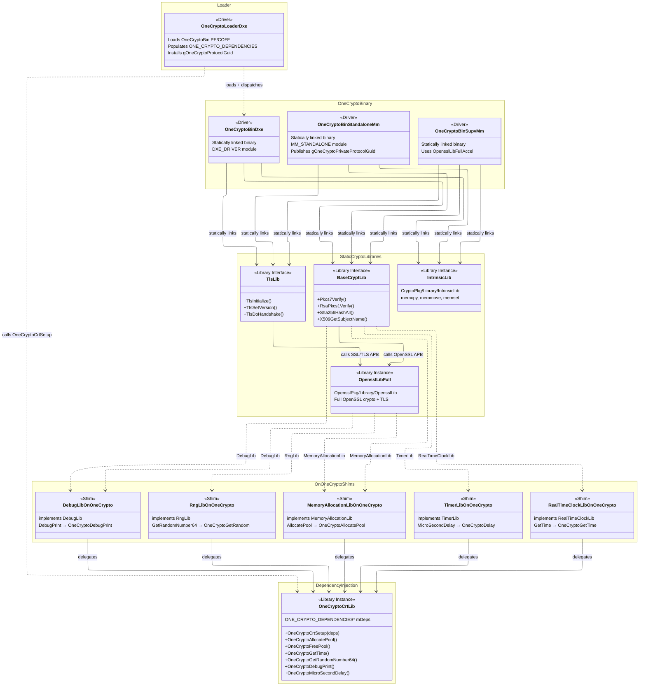

# OneCryptoPkg Architecture

OneCryptoPkg uses a **Bin + Loader** pattern to provide crypto services. A
**Bin** module contains the crypto implementation (BaseCryptLib backed by
OpenSSL) and a **Loader** module discovers the Bin, injects runtime
dependencies, and installs the public `gOneCryptoProtocolGuid` for consumers.

X64 supports a single stored MM binary consumed by DXE.
AARCH64 historically used a separate DXE Bin, and now also has an
MM-provider based single-copy prototype path. See
[Why the Difference?](#why-the-difference) for details.

## X64

X64 defines **5 drivers** total, but a given platform only uses **3** of them.
A platform selects either the StandaloneMm or SupvMm environment — never both —
and the DXE Loader reuses whichever MM binary the platform chose.

| MM Flavor    | Bin (MM + DXE)             | MM Loader                     | DXE Loader          |
|--------------|----------------------------|-------------------------------|---------------------|
| StandaloneMm | `OneCryptoBinStandaloneMm` | `OneCryptoLoaderStandaloneMm` | `OneCryptoLoaderDxe`|
| SupvMm       | `OneCryptoBinSupvMm`       | `OneCryptoLoaderSupvMm`       | `OneCryptoLoaderDxe`|

Both `OneCryptoBinStandaloneMm` and `OneCryptoBinSupvMm` share the same
`FILE_GUID` (`ONE_CRYPTO_BINARY_GUID`), so `OneCryptoLoaderDxe` is agnostic —
it locates whichever one is present in the firmware volume.

### DXE Flow (X64)

On X64 there is no separate DXE Bin driver. The DXE Loader reuses the
platform's `MM_STANDALONE` binary directly:

1. `OneCryptoLoaderDxe` calls `GetSectionFromAnyFv()` with
   `ONE_CRYPTO_BINARY_GUID` to locate the MM Bin PE32 image (either
   `OneCryptoBinStandaloneMm` or `OneCryptoBinSupvMm`, whichever the platform
   included).
2. Calls `gBS->LoadImage()` so the UEFI loader applies the correct memory
   protections and page mappings.
3. Parses the PE/COFF export directory to resolve the `CryptoEntry` symbol.
4. Calls `CryptoEntry()` with a dependency structure (allocators, debug, RNG)
   and receives the crypto protocol in return.
5. Installs `gOneCryptoProtocolGuid` for other DXE drivers.

### MM Flow (X64)

Both StandaloneMm and SupvMm follow the same two-driver pattern:

1. The Bin module is dispatched by the MM environment. Its entry point installs
   `gOneCryptoPrivateProtocolGuid` with a `CryptoEntry` constructor.
2. The Loader has a `[Depex]` on `gOneCryptoPrivateProtocolGuid`. It locates
   the private protocol, calls the constructor with injected dependencies, and
   installs the public `gOneCryptoProtocolGuid`.

## AARCH64

AARCH64 currently has two integration modes:

1. Legacy dual-bin mode (default): dedicated DXE Bin + protocol-based DXE loader.
2. Single-copy AARCH64 mode: secure-world MM Bin is the only stored
    OneCrypto image; DXE fetches image bytes from MM and LoadImage()s them.

### Driver Set by AARCH64 Mode

Legacy dual-bin mode:

- DXE: `OneCryptoBinDxe` + `OneCryptoLoaderDxeByProtocol`
- StandaloneMm: `OneCryptoBinStandaloneMm` + `OneCryptoLoaderStandaloneMm`

Single-copy AARCH64 mode:

- DXE: `OneCryptoLoaderDxeFromMm`
- StandaloneMm: `OneCryptoImageProviderStandaloneMm` +
    `OneCryptoBinStandaloneMm` + `OneCryptoLoaderStandaloneMm`

### DXE Flow (AARCH64)

#### Legacy dual-bin mode

On AARCH64 the DXE Loader cannot directly read the secure-world FV, so this
mode uses a dedicated `OneCryptoBinDxe` (`DXE_DRIVER`) in the normal-world FV:

1. `OneCryptoBinDxe` is dispatched by DXE and installs
    `gOneCryptoPrivateProtocolGuid`.
2. `OneCryptoLoaderDxeByProtocol` has a `[Depex]` on
    `gOneCryptoPrivateProtocolGuid`, calls `LocateProtocol()`, invokes the
    constructor, and installs `gOneCryptoProtocolGuid`.

This protocol-based approach avoids PE/COFF export parsing.

#### Single-copy AARCH64 mode

This mode removes `OneCryptoBinDxe` from the normal-world FV and uses
`OneCryptoLoaderDxeFromMm`. The MM provider stores exactly one OneCrypto image
and serves its bytes to DXE over `EFI_MM_COMMUNICATION2_PROTOCOL`:

1. Loader queries total image size and **serve format** via
   `gOneCryptoImageProviderGuid`.
2. Loader fetches the bytes in chunks sized to the MM communication buffer.
3. Loader consumes the bytes according to the format (below), resolves
   `CryptoEntry`, injects dependencies, and installs `gOneCryptoProtocolGuid`.

##### Two serve formats (boot paths)

The provider is format-agnostic and keys on one invariant: OneCryptoBin's
`FILE_GUID` (`ONE_CRYPTO_BINARY_GUID`). How the platform *packages* that file
selects which path runs — no provider change is needed.

| Format                            | Provider serves               | DXE work                                        | When to use                             |
| --------------------------------- | ----------------------------- | ----------------------------------------------- | --------------------------------------- |
| `ONE_CRYPTO_IMAGE_FORMAT_PE32`    | pristine PE32 bytes           | `LoadImage()` directly                          | discoverable, uncompressed FV           |
| `ONE_CRYPTO_IMAGE_FORMAT_GUIDED_FV` | raw compressed `GUID_DEFINED` bytes | decode, walk FV, extract by GUID, `LoadImage()` | flash constrained; OneCrypto compressed |

The compressed path exists because LZMA decode needs a dictionary + output
buffer roughly the size of the decompressed FV, which secure-world MMRAM
usually cannot spare. The provider therefore never decodes: it ships the small
compressed stream and lets normal-world DXE (ample heap) expand it.

### MM Flow (AARCH64)

`OneCryptoBinStandaloneMm` + `OneCryptoLoaderStandaloneMm` follow the same MM
Bin+Loader pattern as X64.

In single-copy AARCH64 mode, `OneCryptoImageProviderStandaloneMm` is an additional
MM module that registers an MM communication handler and serves the OneCrypto image
bytes to DXE. It is intentionally separate from `OneCryptoLoaderStandaloneMm`:

1. Separation of concerns: transport/provider path vs protocol construction path.
2. Earlier/independent availability: provider can be dispatched without coupling
    to MM loader behavior.
3. Better failure isolation and debugging for MM-communicate contract issues.

## Packaging the Single-Copy Image (FDF / DSC)

The single-copy contract is small: **OneCryptoBin must be present with the
well-known `FILE_GUID`, and be either directly discoverable (scannable FV /
published FV2 HOB) or inside a servable `GUID_DEFINED` LZMA section.**
Compression is the platform's tradeoff.

### Two packaging modes

The provider discovery is **strict**: it matches OneCryptoBin's `FILE_GUID`
directly (Mode A), or a dedicated FV tagged with the well-known
`ONE_CRYPTO_CONTAINER_FV_GUID` (Mode B). It does **not** scan generic
compressed nested FVs.

The well-known GUIDs (`ONE_CRYPTO_BINARY_GUID`, `ONE_CRYPTO_CONTAINER_FV_GUID`)
are defined in `OneCryptoPkg/Include/Guid/OneCryptoFileGuid.h`.

| Mode                            | FDF packaging                                     | Serve format | Flash   | DXE decode |
| ------------------------------- | ------------------------------------------------- | ------------ | ------- | ---------- |
| **A - Direct PE32**             | top-level file in a discoverable FV, uncompressed | `PE32`       | largest | none       |
| **B - Dedicated compressed FV** | its own identity-tagged, LZMA-wrapped FV          | `GUIDED_FV`  | small   | in DXE     |

Mode A is simplest and most robust; Mode B trades a DXE-side LZMA decode for a
smaller flash footprint on space-constrained parts. Either way the platform
must preserve OneCryptoBin's `FILE_GUID` so the provider (Mode A) or DXE
extractor (Mode B) can find it.

### FDF (Mode B example)

Give OneCryptoBin its own compressed FV anchored by a well-known container GUID,
and keep the DXE loader + MM provider/loader in their normal FVs:

```text
[FV.OneCryptoFv]                       # dedicated, compressed
  INF .../OneCryptoBin/OneCryptoBinStandaloneMm.inf

[FV.<SecureMmPayload>]                 # secure-world MM FV
  INF .../OneCryptoLoaders/OneCryptoLoaderStandaloneMm.inf
  INF .../OneCryptoLoaders/OneCryptoImageProviderStandaloneMm.inf
  # anchor the dedicated FV so the provider finds it by identity:
  FILE FV_IMAGE = <ONE_CRYPTO_CONTAINER_FV_GUID> {
    SECTION GUIDED <LZMA_GUID> PROCESSING_REQUIRED = TRUE {
      SECTION FV_IMAGE = OneCryptoFv
    }
  }

[FV.<DxeFv>]                           # normal-world DXE FV
  INF .../OneCryptoLoaders/OneCryptoLoaderDxeFromMm.inf
```

### DSC

Disable shared-crypto for the DXE/MM phases and route `BaseCryptLib` through the
OneCrypto protocol, so the variable/TPM/secure-boot MM consumers depend on
`gOneCryptoProtocolGuid` (published by OneCryptoBin in MM) rather than a
shared-crypto SMM protocol that no longer exists:

```text
[LibraryClasses.common.DXE_DRIVER]
  BaseCryptLib|.../BaseCryptLibOnOneCrypto/DxeCryptLib.inf

[LibraryClasses.common.MM_STANDALONE]
  BaseCryptLib|.../BaseCryptLibOnOneCrypto/StandaloneMmCryptLib.inf
```

Every INF referenced by the FDF must also appear in `[Components]`; list the DXE
loader, MM loader, MM provider, and MM Bin there.

### Heap budget expectations

The bytes that matter are **StandaloneMmCore heap** (secure-world MMRAM), not
the flash FV size. Rough per-component costs during MM bring-up:

| Component                        | Secure-world heap cost                        | Notes                  |
| -------------------------------- | --------------------------------------------- | ---------------------- |
| `OneCryptoBinStandaloneMm`       | ~1.5 MB, ~doubled while resident (FV + image) | full crypto + TLS      |
| MM communication bounce buffer   | up to the comm-buffer size (e.g. ~1 MB)       | transient, per request |
| MM loader / provider             | small (tens of KB)                            | --                     |

The compressed serve path (Mode B) deliberately keeps the **~2 MB LZMA decode**
out of MMRAM — it happens in DXE. The MM heap must still cover the resident
binary (doubled) plus the comm-buffer bounce; the exact heap size a platform
needs depends on its secure carve-out and the rest of its MM driver set, so
treat these as component estimates to add up against the platform's own MMRAM
budget rather than a fixed number.

## Why the Difference?

On AARCH64, StandaloneMm runs inside TrustZone and the secure-world firmware
volume is not accessible from normal-world DXE. On X64, `GetSectionFromAnyFv()`
can reach the MM firmware volume, so the DXE Loader reuses the MM binary
directly.

On AARCH64 there are two valid designs:

1. Legacy dual-bin mode: include separate `OneCryptoBinDxe` in normal-world FV.
2. Single-copy AARCH64 mode: keep the single stored MM Bin and bridge
    secure/non-secure separation using MM communication
    (`OneCryptoImageProvider` and `OneCryptoLoaderDxeFromMm`).

## Module Summary

| Module                         | Type            | X64 | AARCH64 |
|--------------------------------|-----------------|:---:|:-------:|
| `OneCryptoBinStandaloneMm`     | `MM_STANDALONE` |  ✓  |    ✓    |
| `OneCryptoBinSupvMm`           | `MM_STANDALONE` |  ✓  |         |
| `OneCryptoBinDxe`              | `DXE_DRIVER`    |     |    ✓    |
| `OneCryptoLoaderStandaloneMm`  | `MM_STANDALONE` |  ✓  |    ✓    |
| `OneCryptoLoaderSupvMm`        | `MM_STANDALONE` |  ✓  |         |
| `OneCryptoLoaderDxe`           | `DXE_DRIVER`    |  ✓  |         |
| `OneCryptoLoaderDxeByProtocol` | `DXE_DRIVER`    |     |    ✓    |

Single-copy mode modules on AARCH64:

- `OneCryptoLoaderDxeFromMm` (`DXE_DRIVER`)
- `OneCryptoImageProviderStandaloneMm` (`MM_STANDALONE`)

This mode originated as the QAV-A prototype on QemuArmVirtPkg, but the design
is intended for real AARCH64 platforms and mainline integration. The current
feature branch implementation is the bring-up/prototype vehicle.

## Dependency Injection

The crypto Bin binary statically links BaseCryptLib, TlsLib, and OpenSSL, but
it cannot hard-link platform services like DebugLib or MemoryAllocationLib
because those vary per platform. Instead, OneCryptoPkg uses **dependency
injection** through `OneCryptoCrtLib` and a set of `*OnOneCrypto` shim
libraries.

Each shim library (e.g. `DebugLibOnOneCrypto`) implements a standard UEFI
library interface but delegates every call to `OneCryptoCrtLib`, which holds a
pointer to a `ONE_CRYPTO_DEPENDENCIES` structure. At load time, the Loader
populates this structure with the platform's real implementations and calls
`OneCryptoCrtSetup()` before invoking `CryptoEntry`.


