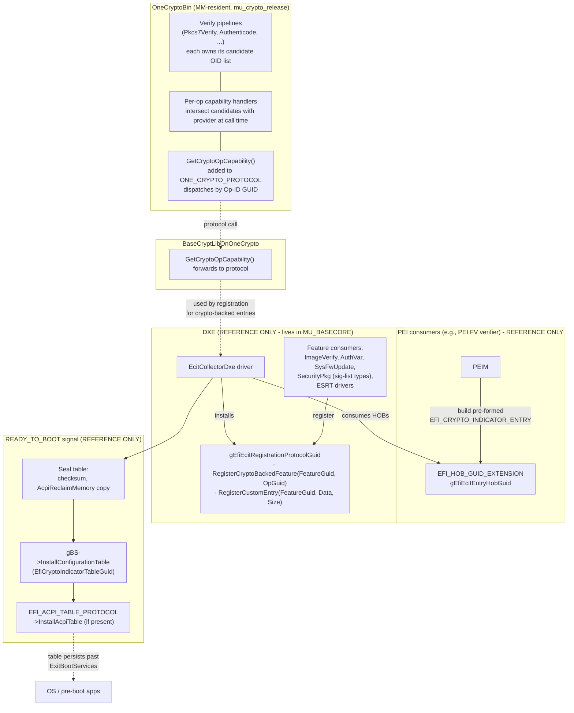
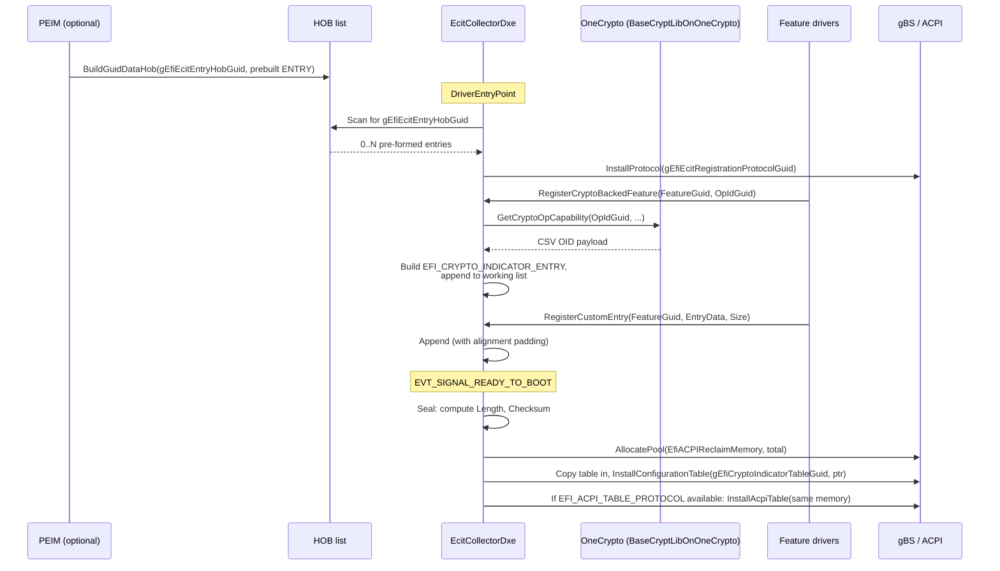

# ECIT Capability Reporting — Design

**Status:** Draft  
**Date:** 2026-06-01  
**Repository:** `mu_crypto_release`  
**Related:** Proposed UEFI specification patch `EFI_CRYPTO_INDICATOR_TABLE` (ECIT)

## 1. Problem

The proposed UEFI EFI Crypto Indicator Table (ECIT) lets firmware advertise
which cryptographic algorithms it can verify on behalf of UEFI features
(Secure Boot image verification, authenticated variables, system firmware
update, ESRT updates, etc.). The OS and pre-boot applications consume this
table to pick algorithms the firmware will accept.

ECIT consumption spans two very different sources of truth:

- The **crypto binary** (this repository, `OneCryptoBin`) knows which signature
  and digest algorithms the verify code paths will accept.
- The **feature owners** (SecurityPkg, MdeModulePkg, per-device drivers in
  MU_BASECORE or platform code) know which ECIT feature their code implements
  and what custom EntryData (e.g., signature-list-type GUIDs, ESRT GUIDs) they
  must publish.

This design defines the contract `mu_crypto_release` will provide so feature
owners can build ECIT entries that accurately reflect what the linked crypto
binary supports, plus a reference end-to-end pipeline (PEI → DXE collector →
ACPI publish) so a downstream owner has an unambiguous integration target.

## 2. Scope

**In scope (implemented in `mu_crypto_release`):**

- A new BaseCryptLib API, `GetCryptoOpCapability`, keyed by per-operation
  GUIDs, returning opaque per-op capability payloads.
- A new function pointer on `ONE_CRYPTO_PROTOCOL` plus a major-version bump.
- A `BaseCryptLibOnOneCrypto` forwarder for the new API.
- Per-op capability handlers co-located with their verify code; each handler
  intersects a local OID candidate list with the linked provider at call
  time. No central capability table inside `OneCryptoBin`.
- HostTest coverage for the API contract and per-op handler behavior.

**Out of scope (documented as reference design only):**

- The DXE ECIT collector driver and its registration protocol.
- PEI HOB producer pattern.
- Per-feature `Register*` calls inside SecurityPkg / MdeModulePkg / platform
  code.
- `EFI_CRYPTO_INDICATOR_TABLE` / `EFI_CRYPTO_INDICATOR_ENTRY` struct
  definitions and ACPI publish logic.

The reference design is included so a downstream MU_BASECORE owner can pick
it up without ambiguity.

## 3. Architecture



### 3.1 Ownership boundaries

| Layer | Owner | Lives in |
|---|---|---|
| Op-ID GUIDs + per-op handlers + candidate OID lists | Crypto binary (each handler co-located with its verify pipeline) | `mu_crypto_release` (this design) |
| `GetCryptoOpCapability` dispatch on protocol | Crypto binary | `mu_crypto_release` (this design) |
| `BaseCryptLibOnOneCrypto` forwarder | Library wrapper | `mu_crypto_release` (this design) |
| ECIT collector driver + registration protocol | Reference design only | MU_BASECORE (SecurityPkg or MdeModulePkg) |
| Per-feature ECIT registration | Reference design only | Each feature's existing home |
| `EFI_CRYPTO_INDICATOR_TABLE` / `_ENTRY` struct definitions | Reference design only | MU_BASECORE (collector package) |
| External compliance/profile validation (WHQL, UEFI, OEM) | Reference design only | `CryptoConformanceApp` (UEFI shell app, see §5.6) |

### 3.2 Design principles

- **Binary stays spec-feature-agnostic.** The crypto binary does not know about
  `EFI_ECIT_FEATURE_*_GUID`. Feature semantics live with the feature.
- **Operation, not primitive.** The keying GUID identifies a crypto *operation
  the consumer asks for* (e.g., "verify a PKCS#7 signature"), not a primitive.
- **Honesty by construction.** Each per-op handler answers at call time by
  intersecting (a) the OIDs the verify pipeline is willing to consider with
  (b) what the linked provider can actually resolve. The answer therefore
  reflects what this build of the firmware will actually verify — never an
  aspirational static table and never an over-promising provider dump.
- **Capability, not compliance.** The binary reports what it can do. It does
  not assert that the result complies with WHQL, UEFI required-algorithm
  profiles, or OEM policy; that is the job of an external conformance app
  (see §5.6).
- **Unordered set semantics.** Payload OIDs are a set, not a ranked list.
  Consumers must apply their own selection policy.
- **Append-only protocol growth.** Pre-existing protocol entries do not move.

## 4. BaseCryptLib / Protocol API

### 4.1 New header

`MU_BASECORE/CryptoPkg/Include/Library/CryptoCapability.h`

```c
//
// Operation-ID GUIDs (declared here; defined in the .c that owns the
// matching per-op handler, co-located with the verify pipeline).
//
extern EFI_GUID gCryptoOpPkcs7VerifyGuid;
extern EFI_GUID gCryptoOpAuthenticodeVerifyGuid;
// ... one per advertised crypto operation

/**
  Return the capability descriptor for a given crypto operation.

  The descriptor is an opaque, operation-specific byte payload. For
  verification operations the payload is a CSV-encoded ASCII string of
  algorithm OIDs (e.g. "1.2.840.113549.1.1.11,1.2.840.10045.4.3.2") with
  a trailing NUL. The OIDs are an UNORDERED SET: callers must not infer
  preference from position. Each OID returned is, at the moment of the
  call, both (a) accepted by the verify pipeline for this operation and
  (b) resolvable by the linked crypto provider. If no candidate satisfies
  both, the payload is an empty string (one NUL byte).

  @param[in]      OpIdGuid    GUID identifying the crypto operation.
  @param[out]     Buffer      NULL to probe required size, else receives payload.
  @param[in,out]  BufferSize  In: size of Buffer. Out: bytes written or required.

  @retval EFI_SUCCESS           Buffer populated (or size returned if Buffer NULL).
  @retval EFI_BUFFER_TOO_SMALL  Buffer too small; *BufferSize set to required.
  @retval EFI_NOT_FOUND         OpIdGuid is unknown to this binary.
  @retval EFI_INVALID_PARAMETER OpIdGuid or BufferSize is NULL.
**/
EFI_STATUS
EFIAPI
GetCryptoOpCapability (
  IN     CONST EFI_GUID *OpIdGuid,
  OUT    VOID           *Buffer       OPTIONAL,
  IN OUT UINTN          *BufferSize
  );
```

### 4.2 Op-ID GUID payload contract (v1 set)

Payload semantics for all v1 ops: **unordered set** of OID strings,
CSV-encoded ASCII, NUL-terminated. Empty payload (one NUL byte) means
"no OID in this op's candidate list is both accepted by the verify path
and resolvable by the linked provider in this build."

| Op-ID GUID | Payload format | Backs which ECIT feature(s) (from the UEFI ECIT patch) |
|---|---|---|
| `gCryptoOpPkcs7VerifyGuid` | CSV ASCII OIDs accepted by the generic PKCS#7 verify pipeline + NUL | `EFI_ECIT_FEATURE_AUTHENTICATED_VARIABLE_GUID`, `EFI_ECIT_FEATURE_SYSTEM_FIRMWARE_UPDATE_GUID`, `EFI_ECIT_FEATURE_ESRT_FIRMWARE_UPDATE_GUID` |
| `gCryptoOpAuthenticodeVerifyGuid` | CSV ASCII OIDs accepted by the Authenticode verify pipeline + NUL | `EFI_ECIT_FEATURE_IMAGE_VERIFICATION_GUID` |

The ECIT patch explicitly notes that Authenticated Variable updates "may be
a different set of OIDs than the Image Verification feature because it is
not limited by Authenticode." Keeping `gCryptoOpPkcs7VerifyGuid` and
`gCryptoOpAuthenticodeVerifyGuid` as separate ops is the binary's way of
respecting that distinction.

New operations can be added in later revisions: define a new GUID, add a
per-op handler next to the verify pipeline that owns it, and register the
GUID-to-handler mapping in the dispatch table. Unknown GUIDs return
`EFI_NOT_FOUND`.

### 4.3 Protocol surface

Add one function pointer to `ONE_CRYPTO_PROTOCOL` (in
`MU_BASECORE/CryptoPkg/Include/Protocol/OneCrypto.h`):

```c
typedef
EFI_STATUS
(EFIAPI *ONE_CRYPTO_GET_OP_CAPABILITY)(
  IN     CONST EFI_GUID *OpIdGuid,
  OUT    VOID           *Buffer       OPTIONAL,
  IN OUT UINTN          *BufferSize
  );

// In ONE_CRYPTO_PROTOCOL, appended at end:
ONE_CRYPTO_GET_OP_CAPABILITY GetCryptoOpCapability;
```

`ONE_CRYPTO_VERSION_MAJOR` bumps to the next value. The forwarder library
rejects mismatched majors with `EFI_INCOMPATIBLE_VERSION`. This is a
breaking change by design: consumers must rebuild against the new protocol.

### 4.4 Implementation: per-op handlers, no central table

There is no central static capability table inside `OneCryptoBin`. Instead,
each verify pipeline owns:

1. A small, local `STATIC CONST CHAR8 *` array of *candidate* OIDs — the
   OIDs the verify pipeline is willing to consider for this operation.
2. A per-op capability handler that, at call time, asks the linked provider
   which candidates can actually be resolved, and emits CSV of the survivors.

The top-level `GetCryptoOpCapability` is a thin dispatcher: it looks up the
handler for `OpIdGuid` and delegates.

```c
// In a shared header co-located with the dispatcher:
typedef
EFI_STATUS
(EFIAPI *CRYPTO_OP_HANDLER) (
  OUT    CHAR8 *Buffer       OPTIONAL,
  IN OUT UINTN *BufferSize
  );

typedef struct {
  CONST EFI_GUID    *OpId;
  CRYPTO_OP_HANDLER  Handler;
} CRYPTO_OP_DISPATCH;

EFI_STATUS EFIAPI
GetCryptoOpCapability (
  IN     CONST EFI_GUID *OpIdGuid,
  OUT    VOID           *Buffer       OPTIONAL,
  IN OUT UINTN          *BufferSize
  )
{
  if (OpIdGuid == NULL || BufferSize == NULL) {
    return EFI_INVALID_PARAMETER;
  }
  for (UINTN i = 0; i < ARRAY_SIZE (mDispatch); i++) {
    if (CompareGuid (OpIdGuid, mDispatch[i].OpId)) {
      return mDispatch[i].Handler ((CHAR8 *)Buffer, BufferSize);
    }
  }
  return EFI_NOT_FOUND;
}
```

Example per-op handler, co-located with the PKCS#7 verify pipeline
(`OpensslPkg/Library/BaseCryptLib/Pk/CryptPkcs7VerifyCommon.c` or a sibling
file in the same directory):

```c
//
// Candidate OIDs the PKCS#7 verify pipeline is willing to consider.
// MUST be a superset of (or equal to) the OIDs the verify code actually
// accepts; runtime intersection with the provider trims the answer to
// what is real for this build.
//
STATIC CONST CHAR8 *CONST mPkcs7VerifyCandidates[] = {
  "1.2.840.113549.1.1.11", // sha256WithRSAEncryption
  "1.2.840.113549.1.1.12", // sha384WithRSAEncryption
  "1.2.840.113549.1.1.13", // sha512WithRSAEncryption
  "1.2.840.10045.4.3.2",   // ecdsa-with-SHA256
  "1.2.840.10045.4.3.3",   // ecdsa-with-SHA384
  // PQC OIDs added here as verify support lands; runtime check filters
  // them out automatically on builds without a PQC-capable provider.
};

EFI_STATUS EFIAPI
Pkcs7VerifyOpCapability (
  OUT    CHAR8 *Buffer       OPTIONAL,
  IN OUT UINTN *BufferSize
  )
{
  // 1. For each candidate, ask the provider whether it resolves
  //    (OBJ_txt2nid + EVP_get_signaturebynid for OpenSSL;
  //     mbedtls_oid_get_* / mbedtls_pk_info_from_type for MbedTLS).
  // 2. Build a CSV of survivors in a local buffer.
  // 3. Honour sizing-probe (Buffer == NULL) and EFI_BUFFER_TOO_SMALL
  //    contracts on *BufferSize.
  // 4. Empty survivor set => emit a single NUL byte.
}
```

The dispatch table lives next to `GetCryptoOpCapability` and references
each per-op handler by extern declaration:

```c
extern EFI_STATUS EFIAPI Pkcs7VerifyOpCapability (CHAR8 *, UINTN *);
extern EFI_STATUS EFIAPI AuthenticodeOpCapability (CHAR8 *, UINTN *);

STATIC CONST CRYPTO_OP_DISPATCH mDispatch[] = {
  { &gCryptoOpPkcs7VerifyGuid,        Pkcs7VerifyOpCapability   },
  { &gCryptoOpAuthenticodeVerifyGuid, AuthenticodeOpCapability  },
};
```

Adding a new op = one new file (or one addition to an existing verify file)
plus one row in `mDispatch[]`. Removing an OID from a verify pipeline =
delete it from that pipeline's candidate array; the next
`GetCryptoOpCapability` call reflects the removal.

### 4.5 Honesty by construction (no drift check)

There is no boot-time "drift check" and no constructor-installed gate. The
honesty mechanism is the runtime intersection in §4.4: each per-op handler
asks the linked provider at call time which candidates resolve, and only
those OIDs make it into the payload.

This design choice avoids three problems the previous draft created:

- A static central table can advertise OIDs the linked provider doesn't
  actually have (e.g., a build without PQC support).
- A constructor-time `ASSERT` is a brittle gate: it can brick boot in
  response to a provider/version change that the *external compliance*
  layer should evaluate, not the binary.
- Both static-link consumers of `BaseCryptLib` and dispatch-via-`OneCrypto`
  consumers get the same answer for free, because the per-op handler is
  the source of truth in both cases — no constructor path to worry about.

Compliance against external profiles (WHQL, UEFI required-algorithm
profiles, OEM policy) is the job of `CryptoConformanceApp` (§5.6), a UEFI
shell app that calls `GetCryptoOpCapability` and reports PASS/FAIL against
a chosen profile. That separation lets the firmware report capability
honestly while profile expectations can evolve independently of the binary.

A HostTest in this repo still validates candidate-list *well-formedness* —
every declared OID parses (`OBJ_txt2nid` for OpenSSL; equivalent for
MbedTLS), and per-op candidate arrays have no duplicates — but it does NOT
fail when a candidate fails to resolve in a given provider build. Non-
resolution is expected and is exactly what runtime intersection is for.

### 4.6 `BaseCryptLibOnOneCrypto` forwarder

```c
EFI_STATUS EFIAPI
GetCryptoOpCapability (IN CONST EFI_GUID *Op, OUT VOID *B OPTIONAL, IN OUT UINTN *S)
{
  ONE_CRYPTO_PROTOCOL *P = GetOneCryptoProtocol ();   // cached locate
  if (P == NULL || P->Major != ONE_CRYPTO_VERSION_MAJOR) {
    return EFI_INCOMPATIBLE_VERSION;
  }
  return P->GetCryptoOpCapability (Op, B, S);
}
```

### 4.7 What this design intentionally does *not* do

- Does **not** define or reference any `EFI_ECIT_FEATURE_*_GUID`.
- Does **not** format `EFI_CRYPTO_INDICATOR_ENTRY` headers.
- Does **not** compute checksums, allocate ACPI memory, or publish anything.
- Does **not** depend on the UEFI ECIT patch landing as-is. Only the *payload
  format* (CSV OID string) is observable to the collector; that format is
  independent of the spec header layout.
- Does **not** rank OIDs by cryptographic strength. The payload is an
  unordered set; consumers (OS, pre-boot apps, conformance app) apply
  their own selection policy.
- Does **not** behave differently in Secure Boot setup mode vs user mode.
  "What algorithm should I enroll for PK/KEK?" is answered the same way:
  here is the set this firmware will verify. The caller picks.
- Does **not** include a raw-hash-OID op (no `gCryptoOpHashOidGuid` in v1).
  The ECIT patch's hash-based image revocation surface is expressed via
  `EFI_SIGNATURE_LIST` *type GUIDs*, not via an OID CSV, and is therefore
  owned by SecurityPkg/the collector — not by OneCrypto. A future hash-OID
  op can be added without a protocol break if a real consumer appears.
- Does **not** assert that the returned set complies with any external
  policy (WHQL, UEFI required-algorithm profiles, OEM policy). That is
  `CryptoConformanceApp`'s job (§5.6).

## 5. Reference design (not implemented here)

This section exists so a downstream MU_BASECORE owner can implement the
collector without ambiguity. No code from this section lands in
`mu_crypto_release`.

### 5.1 New types and GUIDs

These would live in a new MU_BASECORE package (e.g.,
`SecurityPkg/Include/Guid/EcitTable.h`,
`SecurityPkg/Include/Protocol/EcitRegistration.h`).

```c
#define EFI_CRYPTO_INDICATOR_TABLE_SIGNATURE  SIGNATURE_32('E','C','I','T')
#define EFI_CRYPTO_INDICATOR_TABLE_VERSION    1

typedef struct { /* ... per UEFI ECIT patch ... */ } EFI_CRYPTO_INDICATOR_TABLE;
typedef struct { /* ... per UEFI ECIT patch ... */ } EFI_CRYPTO_INDICATOR_ENTRY;

// HOB GUID used by PEI producers; HOB data is one fully-formed,
// 8-byte-padded EFI_CRYPTO_INDICATOR_ENTRY per HOB.
extern EFI_GUID gEfiEcitEntryHobGuid;

// Registration protocol installed by the collector at DXE.
extern EFI_GUID gEfiEcitRegistrationProtocolGuid;

typedef struct _ECIT_REGISTRATION_PROTOCOL ECIT_REGISTRATION_PROTOCOL;

typedef
EFI_STATUS
(EFIAPI *ECIT_REGISTER_CRYPTO_BACKED)(
  IN ECIT_REGISTRATION_PROTOCOL *This,
  IN CONST EFI_GUID             *FeatureGuid,
  IN CONST EFI_GUID             *OpIdGuid
  );

typedef
EFI_STATUS
(EFIAPI *ECIT_REGISTER_CUSTOM)(
  IN ECIT_REGISTRATION_PROTOCOL *This,
  IN CONST EFI_GUID             *FeatureGuid,
  IN CONST VOID                 *EntryData,
  IN UINTN                       EntryDataSize
  );

struct _ECIT_REGISTRATION_PROTOCOL {
  ECIT_REGISTER_CRYPTO_BACKED  RegisterCryptoBackedFeature;
  ECIT_REGISTER_CUSTOM         RegisterCustomEntry;
};
```

### 5.2 Collector lifecycle



### 5.3 Per-feature mapping

Feature GUIDs in this table are the ones defined by the UEFI ECIT patch.

| ECIT Feature GUID | EntryData shape (per patch) | Who registers | Mechanism | OneCrypto op consulted |
|---|---|---|---|---|
| `EFI_ECIT_FEATURE_IMAGE_VERIFICATION_GUID` | CSV OIDs (`EFI_CIE_DATA_IMAGE_VERIFICATION_ENTRY`) | DxeImageVerificationLib hook | `RegisterCryptoBackedFeature` | `gCryptoOpAuthenticodeVerifyGuid` |
| `EFI_ECIT_FEATURE_AUTHENTICATED_VARIABLE_GUID` | CSV OIDs (`EFI_CIE_DATA_AUTH_VARS_ENTRY`) | AuthVariableLib hook | `RegisterCryptoBackedFeature` | `gCryptoOpPkcs7VerifyGuid` |
| `EFI_ECIT_FEATURE_SYSTEM_FIRMWARE_UPDATE_GUID` | CSV OIDs (`EFI_CIE_DATA_SYS_FW_UPDATE_ENTRY`) | SystemFirmwareUpdate / capsule | `RegisterCryptoBackedFeature` | `gCryptoOpPkcs7VerifyGuid` |
| `EFI_ECIT_FEATURE_ESRT_FIRMWARE_UPDATE_GUID` | `{Esrt_Guid, CSV OIDs}` (`EFI_CIE_DATA_ESRT_ENTRY`) | Per FmpDevice driver | `RegisterCustomEntry` (driver wraps op result with its `Esrt_Guid`) | `gCryptoOpPkcs7VerifyGuid` |
| `EFI_ECIT_FEATURE_SECURE_BOOT_AUTHORIZATION_GUID` | `EFI_GUID SignatureListSupportedTypes[]` | SecurityPkg AuthService | `RegisterCustomEntry` | **none** — sig-list-type policy; not OID-CSV |
| `EFI_ECIT_FEATURE_SECURE_BOOT_SERVICING_AUTHORIZATION_GUID` | `EFI_GUID SignatureListSupportedTypes[]` | SecurityPkg AuthService | `RegisterCustomEntry` | **none** — sig-list-type policy; not OID-CSV |
| `EFI_ECIT_FEATURE_IMAGE_REVOCATION_GUID` | `EFI_GUID SignatureListSupportedTypes[]` | SecurityPkg dbx logic | `RegisterCustomEntry` | **none** — sig-list-type policy; not OID-CSV |

The three signature-list-type features are 100% SecurityPkg/collector owned;
`mu_crypto_release` provides no `gCryptoOp*` GUID for them, and the per-op
handler dispatch will never be invoked on their behalf.

### 5.4 Boundary behaviors

- **PEI publication.** PEIMs that need to publish an entry pre-DXE build a
  fully-formed `EFI_CRYPTO_INDICATOR_ENTRY` (header + EntryData, 8-byte
  aligned) and emit one HOB per entry with `gEfiEcitEntryHobGuid`. Collector
  consumes them at entry; no PEI/DXE crypto-protocol crossing.
- **Late registration.** Registrations after `READY_TO_BOOT` are rejected
  with `EFI_ACCESS_DENIED`. The protocol stays installed so consumers see a
  deterministic error rather than a crash.
- **No producers, no table.** If zero entries are registered or HOBbed, no
  ECIT is published. Avoids an empty table claiming "this firmware supports
  no crypto."
- **ACPI optional.** If `EFI_ACPI_TABLE_PROTOCOL` isn't located, the same
  memory still gets `InstallConfigurationTable`'d, but allocated as
  `EfiBootServicesData` per the spec note.
- **Spec drift insurance.** All spec-side structs live in the collector
  package, not in `mu_crypto_release`. If the UEFI spec changes the header
  layout before ratification, only the collector package is affected.

### 5.5 Does this end at BDS?

Assembly ends at `EVT_SIGNAL_READY_TO_BOOT` (start of BDS). The published
table outlives `ExitBootServices` because of `EfiACPIReclaimMemory` allocation
plus the persistent `EFI_CONFIGURATION_TABLE` pointer. OS-runtime parsing of
ECIT is therefore well-defined.

### 5.6 `CryptoConformanceApp` (UEFI shell app — reference only)

A UEFI shell application that validates a platform's firmware-reported
crypto capability against an external profile. Lives outside this repo
(e.g., in a UefiPayloadPkg-adjacent or platform-side validation package);
documented here so the responsibility split is unambiguous.

Behavior:

1. Enumerates the known set of Op-ID GUIDs and calls `GetCryptoOpCapability`
   for each (via `BaseCryptLib`).
2. Parses `EFI_CRYPTO_INDICATOR_TABLE` from the `EFI_CONFIGURATION_TABLE`
   list (when published).
3. Loads a profile descriptor: a list of `(feature, required OIDs, optional
   OIDs, forbidden OIDs)` tuples. Profiles can be WHQL, UEFI spec
   required-algorithm sets, or OEM internal policy.
4. Reports PASS/FAIL per feature with details on missing, unexpected, or
   forbidden OIDs.
5. Exit code reflects overall pass/fail so the app drops cleanly into
   automated validation pipelines (lab QEMU runs, OEM compliance gates).

Why this lives outside the binary:

- Profiles change on a different cadence than firmware. A WHQL revision
  shouldn't require a re-release of `OneCryptoBin`.
- Multiple distinct profiles may apply simultaneously (WHQL + UEFI + OEM);
  the binary cannot pick a canonical one.
- A failed compliance check should not brick boot. It should be a CI/lab
  signal that the *image* needs rebuilding with different verify policy or
  a different provider build.

The app is the answer to the setup-mode question "what's the strongest
algorithm this firmware will accept for PK/KEK enrollment given my
profile?" — it filters and ranks the binary's honest, unordered capability
set by the profile's preference order.

## 6. Testing

### 6.1 Tests landing in this repo

| Test | Location | Purpose |
|---|---|---|
| `GetCryptoOpCapability` dispatch — sizing probe, exact-fit, too-small, unknown GUID, NULL params | `OpensslPkg/HostTest/CryptoOpCapabilityHostTest/` | API contract |
| Per-op handler well-formedness — every candidate OID parses (`OBJ_txt2nid` ≠ `NID_undef`), no duplicates per op | Same | Catches malformed candidate lists at CI time |
| Per-op handler against real provider — call returns CSV that is a subset of the candidate list and contains only OIDs the provider resolves | Same | Validates the runtime intersection |
| Empty-payload behavior — handler with all candidates filtered out returns single NUL byte | Same | Honesty edge case |
| `BaseCryptLibOnOneCrypto` forwarder — returns `EFI_INCOMPATIBLE_VERSION` on major mismatch; forwards correctly on match | `OneCryptoPkg/Test/BaseCryptLibOnOneCryptoTest/` | ABI/version gating |
| Mirror tests for `MbedTlsPkg/Library/BaseCryptLib` | `MbedTlsPkg/HostTest/` | Provider parity |

Explicitly **not** required:

- A pass/fail "policy ↔ provider drift" gate. Non-resolution of a
  candidate is normal and is exactly what the runtime intersection in §4.4
  exists to handle.
- A constructor-time consistency check. The runtime answer is authoritative.

### 6.2 Tests intentionally *not* in this repo

- Collector behavior, HOB merge, READY_TO_BOOT seal, ACPI checksum belong
  with the collector implementation in MU_BASECORE.
- `CryptoConformanceApp` (§5.6) and its profile descriptors belong with
  the app's own repo / validation package.

## 7. Compatibility and rollout

### 7.1 Build flag / opt-out

No new PCD. The new function pointer is always present on the new protocol
major. Per-op candidate arrays plus the dispatch table cost a few dozen
bytes of `.rdata` per op. A consumer that doesn't care simply never calls
the function.

### 7.2 Protocol versioning rules

- `ONE_CRYPTO_VERSION_MAJOR` bumps to the next value (breaking change).
- `GetCryptoOpCapability` is appended to the end of the protocol struct.
- The forwarder library rejects mismatched majors with
  `EFI_INCOMPATIBLE_VERSION`.
- This signals to consumers: rebuild against the new protocol.

### 7.3 Spec-drift exposure

The v1 op set was deliberately scoped to features the UEFI ECIT patch
defines with CSV-OID EntryData (Image Verification, Authenticated
Variable, System FW Update, ESRT). For those features, payload format
drift risk is low.

| Spec change | Impact on `mu_crypto_release` |
|---|---|
| Different `EFI_CRYPTO_INDICATOR_TABLE` header layout | None — collector owns this |
| Different `EFI_CRYPTO_INDICATOR_ENTRY` header layout | None — collector owns this |
| New `EFI_ECIT_FEATURE_*_GUID` | None — feature GUIDs are not in the binary |
| Different EntryData format for an existing CSV-OID feature | Re-encode in the collector, or add a sibling `gCryptoOp*` GUID whose per-op handler emits the new format. No protocol break. |
| New crypto-backed feature (e.g., a future PQC-only verify pipeline) | Add a new `gCryptoOp*` GUID + per-op handler next to the new verify code + one row in `mDispatch[]`. No protocol break unless combined with other breaking changes. |
| ECIT patch deprecates a CSV-OID feature | Leave the op present (so older collectors keep working); feature simply has no registrant. |

### 7.4 Rollout sequence

1. Land §4 on `main`: protocol major bump, dispatcher, per-op handlers
   co-located with PKCS#7 and Authenticode verify pipelines,
   `BaseCryptLibOnOneCrypto` forwarder, HostTests for dispatch and
   per-op handler behavior (no drift gate).
2. Cut a `OneCryptoBin` release with the new major.
3. **Downstream, out of scope here:** collector driver in MU_BASECORE,
   per-feature `RegisterCryptoBackedFeature` / `RegisterCustomEntry` calls,
   platform `.dsc` inclusion, and `CryptoConformanceApp` for external
   profile validation.

## 8. Open questions

- **GUID values.** Concrete GUIDs for `gCryptoOpPkcs7VerifyGuid` and
  `gCryptoOpAuthenticodeVerifyGuid` to be generated during implementation.
  They are stable forever once assigned.
- **Authenticode vs PKCS#7 candidate lists.** The exact OIDs each pipeline
  is willing to consider differ (the ECIT patch explicitly anticipates
  this); finalize each candidate array against the current
  `CryptAuthenticode.c` and `CryptPkcs7VerifyCommon.c` policy when
  implementing the per-op handlers.
- **MbedTLS parity.** The MbedTLS variant of `BaseCryptLib` ships a different
  surface; confirm per-op handlers for both ops are feasible against
  MbedTLS's narrower verify support (the runtime-intersection model means
  the *candidate list* can be identical across providers and MbedTLS will
  simply contribute a smaller payload at runtime).
- **Provider-resolution helper.** Decide whether the per-op handler calls
  the provider directly (`OBJ_txt2nid` + `EVP_get_*bynid`) or via a thin
  internal helper exposed for both ops. A helper deduplicates code; direct
  calls keep each handler self-contained. Lean: helper, in the same file
  as the dispatcher.
